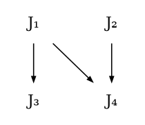

## Personnel Assignment Problem

### 問題定義

&emsp;&emsp;Personnel assignment problem（以下簡寫 PAP）是在特定條件下，將任務分配給人員的問題。給定以下三個輸入：（1）所有人員的 linearly ordered set $P = \{P_1,P_2,...,P_n\}$，（2）所有任務的 partially ordered set $J = \{J_1,J_2,...,J_n\}$，以及（3）將 $P_i$ 分配到 $J_j$ 所需要之成本 $C_{ij}$ 的集合，PAP 的目標是找到一對一的 feasible assignment，使得成本總和最低。
&emsp;&emsp;定義一個函式 $f：P→J$ 。Feasible assignment 是指如果 $P_i$ 和 $P_j$ 分別分配到 $f(P_i)$ 和 $f(P_j)$，則必須滿足如果 $f(P_i) ≤ f(P_j)$，則 $P_i ≤ P_j$。而成本總和定義如下：$$\sum_{i,j} C_{ij}X_{ij}, \text{ where } X_{ij}=\begin{cases} 1 \text{ if } P_i \text{ is assigned to } J_j \\ 0 \text{ otherwise } \end{cases}$$&emsp;&emsp;舉例：假設 $P = \{P_1,P_2,P_3\}$，$J = \{J_1,J_2,J_3\}$，其中 $P_1≤P_2≤P_3$，$J_1≤J_3$，$J_2≤J_3$。考慮 Assignment 1：$P_1→J_1, P_2→J_2, P_3→J_3$，以及 Assignment 2：$P_1→J_1, P_2→J_3, P_3→J_2$。Assignment 1 是 feasible，但 Assignment 2 不是，因為 $P_2→J_3$、$P_3→J_2$ 違反條件。

### 解法敘述

&emsp;&emsp;雖然 PAP 是 NP-hard，但利用 branch and bound（以下簡稱 B&B）仍然可以有效率地解決 PAP，一句話說明此演算法就是：在所有的 topological sort 中，利用 B&B 找到使成本總和最小的。
&emsp;&emsp;首先，針對 topological sort 作探討。任務的集合擁有 partially ordering 的特性，故可以將所有的任務經由 topological sort 來作排序。我們可以觀察到，任何 topological sort 的結果都可以產生一個 feasible assignment，如下：
1. $P$ 是 linearly ordered set，所以可以經由一般的排序演算法，在 $O(n\log n)$ 的時間內完成排序。我們可以不失一般性地假設 $P_1≤P_2≤...≤P_n$ 是排序後的結果。
2. $J$ 是 partially ordered set，可以經由 topological sort 來作排序。假設排序後的結果是 $J_1,J_2,...,J_n$，則此序列必然滿足如果 $J_i≤J_j$，則 $i<j$。
3. Feasible assignment：$P_1→J_1, P_2→J_2, ..., P_n→J_n$。此 assignment 滿足條件，因為如果 $J_i≤J_j$，則 $i<j$，則 $P_i≤P_j$。

&emsp;&emsp;舉例：假設 $P=\{P_1,P_2,P_3,P_4\}$，其中 $P_1≤P_2≤P_3≤P_4$，$J$ 可以透過 digraph 呈現（下圖），其中 $J_i→J_j$ 代表 $J_i≤J_j$。
- $J_2,J_1,J_3,J_4$ 是 topological sort。Assignment：$P_1→J_2, P_2→J_1, P_3→J_3, P_4→J_4$。
- $J_3,J_2,J_1,J_4$ 不是 topological sort，因為 $J_1≤J_3$，但 $J_3$ 在 $J_1$ 前面。

&emsp;&emsp;所有的 topological sort 都可以產生一個 feasible assignment，利用 tree searching 可以用來找到所有可能的排序，方法如下：
- 從 digraph 中挑選任何一個 indegree $= 0$ 的元素。
- 將此元素放入 topological sorting 的序列中。
- 將此元素從 digraph 中移除。

&emsp;&emsp;舉例：參考上圖的 digraph，執行上述的步驟可以產生下圖的 tree。考慮一開始 topological sorting 還沒有任何元素時， indegree $= 0$ 的元素有 $J_1$ 和 $J_2$，所以 root 有兩個 child nodes 可以分別作為 topological sorting 的頭。假設我們先挑選 $J_1$ 執行 depth first search（DFS），並將 $J_1$ 從 digraph 中移除，剩下的 digraph 再重複執行上述的步驟，直到所有的 nodes 都被移除。Tree 中的每一條從 root 到 leaf 的路徑都是合法的 topological sorting 序列。

&emsp;&emsp;每次選入一個元素放進 tree 的時候，B&B 會估計這個選擇的 lower bound，如果選擇這個 node 所估計的 lower bound 高於目前的最佳解，則可以直接捨棄這個分支，不繼續往下執行 DFS。Lower bound 的估計如下。給定所有成本 $C_{ij}$ 的集合，可以透過成本矩陣表示（下表 1），每一列代表一個人員，而每一行代表一個任務。接下來，我們從每一列、每一行減去一個常數，使得新成本 $≥ 0$，並產生新的成本矩陣，而這樣的操作並不會改變最佳解。以下表 1 為例，一開始有一個原始的成本矩陣，首先從第 1 到第 4 列分別減去 12、26、3、10，再從第 2 行減去 3，於是產生下表 2。觀察下表 2，可以發現，每一列、每一行都至少有一個 0，所以無法再繼續扣除。而所有被扣除的常數之總和就是目前這個矩陣的 lower bound。以下表 2 為例，lower bound $= 12+26+3+10+3 = 54$，就是 root 的成本，還沒繼續往下執行 DFS 就已經有 54 的成本。  
|表 1|表 2|
|----|---|
|||
&emsp;&emsp;每次挑選一個 node 放入 topological sorting 序列，並更新成本矩陣。假設決定在 tree 的第 $i$ 層放入第 $j$ 個任務，則這個選擇所導致的 lower bound 必須加上目前的 $C_{ij}$，同時把成本矩陣的第 $i$ 列跟第 $j$ 行都更新為 $∞$，意味著第 $i$ 個人員暫時不能被分配到其他任務，而第 $j$ 個任務暫時不能分配給其他人，並接著確認是否還能夠從每一列、每一行減去常數。

&emsp;&emsp;接續同樣的 tree，每個選擇所對應的 lower bound 如上圖的 tree 所示。這裡舉一個例子。假設決定在 tree 的第 1 層放入第 2 個任務，則 lower bound 必須加上 $C_{12}=4$ 而成 $54+4=58$，而成本矩陣的第 1 列跟第 2 行都更新為 $∞$，所產生的成本矩陣如下表。 

&emsp;&emsp;可以估計 lower bound 之後，我們每次選擇 lower bound 較小的那個分支先繼續往下執行 DFS，直到 leaf 後停止，並更新目前為止的最佳解。只要一發現某個選擇的 lower bound 大於目前的最佳解，則根本就不需要繼續往下執行。
&emsp;&emsp;總結本演算法的所有步驟：
Algorithm($P$,$J$,$C$)：
1. 排序 $P$。
2. 建立 $J$ 所代表的 Digraph：若 $J_i≤J_j$，則有一條從 $J_i$ 指向 $J_j$ 的邊。
3. 最佳解 $← ∞$。
4. 建立一棵 Tree 裡面只有 Root。
5. Root 的 lower Bound $← C$ 的 lower bound。
6. Candidates $←$ 所有 indegree $= 0$ 之 nodes。
7. 計算每個 Candidates 所導致的 lower bound。
8. 挑選 lower bound 最小的分支往下層執行，並將其從 Digraph 移除。若 lower bound $≥$ 最佳解，則直接略過此分支。
9. 當抵達 leaf，更新最佳解 $=\min$(最佳解,當前成本)。
10. 返回上一層，重覆執行 6-9 直到沒有分支可以繼續執行 DFS。

### 讀後心得

&emsp;&emsp;本演算法巧妙地將問題簡化成 topological sorting，再將 topological sorting 以 tree 來表現，並定義了如何估計 lower bound，而可以利用 B&B 來解決 PAP 此問題。Topological sorting 序列的個數可以高達 $O(n!)$，然而 B&B 能夠將 lower bound 高於當前最佳解的分支捨棄，從而達到高效率。以老師上課所提到的公式來說，可以被捨棄掉的比例可以透過 ratio = 1 - the number of nodes generated / the number of nodes in the complete tree 來計算，雖然我沒有實際做過實驗，但可以相信這個比例一定相當高，這也是 B&B 厲害的地方。
&emsp;&emsp;在估計 lower bound 的過程，於 traveling salesman problem （TSP）類似，會有一個成本矩陣，接著每一列、每一行減去一個常數，使得新成本 $≥ 0$，並產生新的成本矩陣。這個操作可以讓我們得到最高的 lower bound，而 lower bound 越高，我們就可以越早捨棄一個分支，故我認為 PAP 與 TSP 在利用 B&B 的過程有異曲同工之妙。
&emsp;&emsp;本演算法用到 partial ordering 和 topological sorting 等概念，在老師的離散數學中已略窺一二，相關詞彙所代表的意思比較能夠掌握。利用數學巧妙的性質，我們可以把一個抽象的問題轉換成可以運算的數學模型，從而設計演算法來解決，可見數學的基礎在演算法的設計上佔有相當重要的角色。
&emsp;&emsp;作者在論文中有提到，PAP 本身是 NP-hard，許多人遇到 NP-hard 可能就會雙手一攤，認為沒有演算法可以有效解決。然而，如果有願意嘗試不同技巧（例如 P&S、B&B 等等），將問題的搜尋空間巧妙地縮小，即使問題本身仍然是 NP-hard，但在多數的情況下，仍然可以很有效率地透過演算法解決。無論是上課提到的 knapsack problem、TSP，還是本篇所探討的 PAP，都實踐了這樣的精神。現實生活中，許多問題正是需要這樣嘗試的精神，一個例子是 satisfiability problem，對於數位邏輯設計的正確性，正是需要透過 satisfiability 來驗證，畢竟數位邏輯設計是不允許出現無法預料的錯誤，Intel 過去的歷史已經告訴後人這樣的教訓。許多巧妙的演算法都是以工程背景的人出發，大膽嘗試各種方法，來使這個技術漸趨成熟，著名的 Mini-SAT 套件，也利用與 P&S 和 B&B 近似的概念，有效減少搜尋空間。
