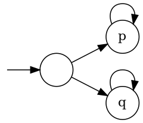

## Homework 6

1. Consider any path $π$.
    - Suppose $π⊨φ\text{U}ψ$. Let $n$ be the smallest number that $π^n⊨ψ$. $π⊨\text{F}ψ$ holds. For every $0≤i<n$ we have $π^i⊨φ$. Hence, for every $0≤j≤n$ we have $π^j⊨φ∨ψ$. Hence, $π⊨ψ\text{R}(φ∨ψ)$ holds.
    - Suppose $π⊨ψ\text{R}(φ∨ψ)∧\text{F}ψ$. Since $π⊨\text{F}ψ$, let $n$ be the smallest number that $π^n⊨ψ$. For every $0≤i<n$ we have $π^i⊨¬ψ$. Since $π⊨ψ\text{R}(φ∨ψ)$, for every $0≤j≤n$ we have $π^j⊨φ∨ψ$. Hence, for all $0≤k<n$ we have $π^k⊨φ$. Hence, $π⊨φ\text{U}ψ$ holds.
2. Consider any path $π$.
    - Suppose $π⊨φ\text{W}ψ$.
        - If there is some $i≥0$ such that $π^i⊨ψ$ and for every $0≤j<i$ we have $π^j⊨φ$, then for every $0≤k≤i$, we have $π^k⊨φ∨ψ$. Hence, $π⊨ψ\text{R}(φ∨ψ)$ holds.
        - If for every $i≥0$ we have $π^i⊨φ$, then for every $i≥0$ we have $π^i⊨φ∨ψ$. Hence, $π⊨ψ\text{R}(φ∨ψ)$ also holds.
    - Suppose $π⊨ψ\text{R}(φ∨ψ)$.
        - If there is some $i≥0$ such that $π^i⊨ψ$ and for every $0≤j≤i$ we have $π^j⊨φ∨ψ$. Let $n$ be the smallest of such $i$. For every $0≤j<n$ we have $π^j⊨¬ψ$. Hence, for every $0≤k<n$ we have $π^k⊨φ$. Hence, $π⊨φ\text{W}ψ$ holds.
        - If for every $i≥0$ we have $π^i⊨φ∨ψ$ and there is no such $j≥0$ such that $π^j⊨ψ$, then for every $k≥0$ we have $π^k⊨φ$. Hence, $π⊨φ\text{W}ψ$ holds.
3. $M$ is designed as below. Let $φ=p$ and $ψ=q$.

4. [AG(_q_ ⇒ ¬EF (_p_ ∧EF _r_))]∧[AG(_r_ ⇒ ¬EF (_p_ ∧EF _q_))]
5. 
