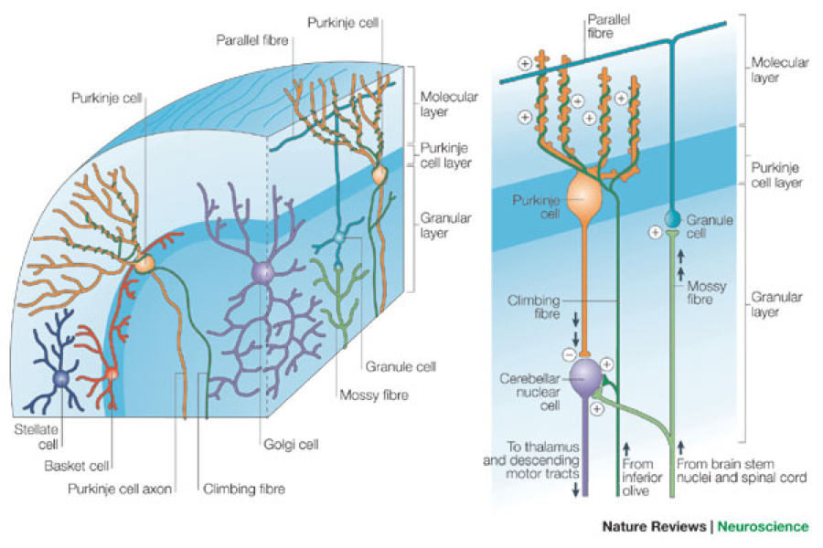

# Nervous System

## Types of Neurons

## Neurotransmitters

|Neurotransmitter|Location|Precursor|Metabolites|
|-|-|-|-|
|Acetylcholine|Basal nucleus of Meynert|-|Acetate & Choline|
|Dopamine|Ventral tegmentum Substantia nigra|Tyrosine|Homovanillic acid (HVA)|
|Norepinephrine|Nucleus ceruleus|Tyrosine|Vanillylmandelic acid (VMA)|
|Epinephrine|Adrenal medulla|Tyrosine|Vanillylmandelic acid (VMA)|
|Serotonin|Raphe nucleus|Tryptophan|5-hydroxyindoleacetic acid (5-HIAA)|
|Histamine|-|Histidine|-|
|Glutamate|-|Glutamate|-|
|GABA|Nucleus accumbens|Glutamate|-|
|Glycine|-|Glycine|-|
|Opioid|-|-|-|

## Cerebral Cortex

### Layers

- Molecular layer
- External granular layer
- External pyramidal layer
- Internal granular layer
- Internal pyramidal layer
- Multiform layer

### Cells

- Horizontal [Cajal] cell
- Granular cell
- Pyramidal cella
- Fusiform cell
- Martinotti cell

## Cerebral Medulla

### Projections

- Corona radiata
- Internal capsule

### Associations

- Uncinate
- Superior longitudinal
- Inferior longitudinal
- Superior occipitofrontal
- Inferior occipitofrontal

### Commissures

- Fornix commissure
- Anterior commissure
- Corpus callosum

## Thalamus

|Nucleus|Function|
|-|-|
|Lateral geniculate nucleus (LGN)|Vision|
|Medial geniculate nucleus (MGN)|Audition|
|Ventral anterior (VA) Ventral lateral (VL)|Motion|
|Ventral posterolateral (VPL)|Sensation below the neck|
|Ventral posteromedial (VPM)|Sensation above the neck|

## Hypothalamus

|Nucleus|Function|
|-|-|
|Lateral|Hunger|
|Ventromedial|Satiety|
|Anterior|Parasympathetic|
|Posterior|Sympathetic|
|Suprachiasmatic|Circadian rhythm|
|Supraoptic|Vasopressin|
|Paraventricular|Oxytocin|

## Cerebellum

### Layers

|Structure|Input|Output|
|-|-|-|
|Molecular layer|-|-|
|Purkinje layer|Cerebellar cortex|Cerebellar nuclei|
|Granular layer|Mossy fiber|Purkinje cell|

### Fibers

|Structure|Input|Output|
|-|-|-|
|Mossy fiber|Cerebrum & Spinal cord|Granule cell|
|Climbing fiber|Inferior olivary nucleus|Purkinje cell|

### Cells

|Structure|Input|Output|
|-|-|-|
|Basket cell|-|Purkinje cell|
|Stellate cell|-|Purkinje cell|
|Granule cell|Mossy fiber|Purkinje cell|
|Purkinje cell|Cerebellar cortex|Cerebellar nuclei|

### Nuclei

|Structure|Input|Output|
|-|-|-|
|Dentate nucleus|-|-|
|Emboliform nucleus|-|-|
|Globose nucleus|-|-|
|Fastigial nucleus|-|-|

## Basal Ganglion

- Striatum: putamen & caudate nucleus
- Lentiform nucleus: putamen & globus pallidus

## Limbic System

- Fimbria
- Dentate gyrus
- Hippocampus
- Subiculum
- Cingulate gyrus
- Uncus
- Parahippocampus
- Amygdala

## Arterial Supply of the Brain

## Dural Venous Sinuses

## Ventricular System of the Brain

- Choroid plexus
- Lateral ventricles
- 3rd ventricle
- Cerebral aqueduct of Sylvius
- 4th ventricle
- Central canal
- Subarachnoid space
- Arachnoid granulations

## Arachnoid Granulation

## Groups of Cranial Nerves

|Group|Cranial Nerves|
|-|-|
|Pure sensory nerves|I & II & VIII|
|Pure motor nerves|III & IV & VI & XI & XII|
|Mixed sensory & motor nerves Branchial arch innervation|V & VII & IX & X|
|Parasympathetic nucleus|III & VII & IX & X|
|Solitary nucleus|VII & IX & X|
|Ambiguous nucleus|IX & X & XI|

## Afferent Pathways

|Pathway|Function|1° Neuron|2° Neuron|3° Neuron|
|-|-|-|-|-|
|CN I|SVA|Olfactory epithelium|Olfactory bulb|-|
|CN II|SSA|Retina|Thalamus :: LGN|-|
|CN V|GSA|Trigeminal ganglion|Trigeminal nucleus|Thalamus :: VPM|
|CN VII|SVA|Geniculate ganglion|Solitary nucleus|Thalamus|
|CN VIII|SSA|Vestibular ganglion|Vestibular nucleus|Thalamus :: MGN|
|||Spiral ganglion|Cochlear nucleus|Thalamus :: MGN|
|CN IX|GVA|Superior & Inferior ganglion|Solitary nucleus|Thalamus|
|CN X|GVA|Superior & Inferior ganglion|Solitary nucleus|Thalamus|

## Somatic Efferent Pathways

### Pyramidal

- Lateral corticospinal tract
- Ventral corticospinal tract

### Extrapyramidal

- Tectospinal tract
- Rubrospinal tract
- Vestibulospinal tract
- Reticulospinal tract

## Spinal Tracts

|Tract|Side|Functions|
|-|-|-|
|Dorsal column|Ipsilateral|Proprioception Touch Pressure Vibration|
|Spinothalamic tract|Contralateral|Pain Temperature|
|Lateral corticospinal tract|Ipsilateral|Motion|
|Ventral corticospinal tract|Contralateral|Motion|

## Pathway of Dorsal Column-Medial Lemniscus System

|Neuron|Level|Side|Structure|
|-|-|-|-|
|**1° Neuron**|Periphery|Ipsilateral|Peripheral nerve|
||Periphery|Ipsilateral|Dorsal root ganglion|
||Spinal cord|Ipsilateral|Dorsal column: Gracile fasciculus Cuneate fasciculus|
|**2° Neuron**|Medulla|Ipsilateral|Gracile nucleus Cuneate nucleus|
||Medulla|Decussation|Internal arcuate fiber|
||Medulla|Contralateral|Medial lemniscus|
|**3° Neuron**|Thalamus|Contralateral|VPL nucleus|
||Cerebrum|Contralateral|Internal capsule|
||Cerebrum|Contralateral|1° somatic cortex|

## Pathway of Anterolateral System

|Neuron|Level|Side|Structure|
|-|-|-|-|
|**1° Neuron**|Periphery|Ipsilateral|Peripheral nerve|
||Periphery|Ipsilateral|Dorsal root ganglion|
|**2° Neuron**|Spinal cord|Ipsilateral|Substantia gelatinosa Nucleus proprius|
||Spinal cord|Decussation|Anterior white commissure|
||Spinal cord|Contralateral|Spinothalamic tract|
|**3° Neuron**|Thalamus|Contralateral|VPL nucleus|
||Cerebrum|Contralateral|Internal capsule|
||Cerebrum|Contralateral|1° somatic cortex|

## Pathway of Corticospinal Tract

|Neuron|Level|Side|Structure|
|-|-|-|-|
|**1° Neuron**|Cerebrum|Ipsilateral|1° motor cortex|
||Cerebrum|Ipsilateral|Internal capsule|
||Midbrain|Ipsilateral|Cerebral peduncle|
||Medulla|Decussation|Pyramidal decussation|
||Spinal cord|Contralateral|Lateral corticospinal tract|
|**2° Neuron**|Spinal cord|Contralateral|Anterior horn|
||Periphery|Contralateral|Ventral root|

## Structures in the Spinal Cord

|Structure|Level|
|-|-|
|Cervical enlargement|C5 ~ T1|
|Lateral horn :: sympathetic|T1 ~ L2|
|Lumbosacral enlargement|L2 ~ S2|
|Lateral horn :: parasympathetic|S2 ~ S4|
|Cervical plexus|C5 ~ T1|
|Intercostal nerve|T1 ~ T11|
|Lumbosacral plexus|T12 ~ S4|
|Lumbar puncture|L3 ~ L5|

## Afferent Neurons

|Neuron|Fiber|Sensation|
|-|-|-|
|I|-|Proprioception|
|II|A-β|Touch Pressure Stretch Vibration|
|III|A-δ|Sharp pain Cold|
|IV|C|Dull pain Warm|

## Cutaneous Sensory Receptors

|Receptor|Location|Sensation|Adaption|
|-|-|-|-|
|Meissner corpuscle|Papillary dermis|Touch|Rapid|
|Merkel disc|Papillary dermis|Pressure|Slow|
|Ruffini corpuscle|Reticular dermis|Stretch|Slow|
|Pacinian corpuscle|Subcutis|Vibration|Rapid|
|Free nerve endings|Papillary dermis|Pain Temperature|Rapid Slow|

## Cranial Nerve Reflexes

|Reflex|Afferent|Efferent|
|-|-|-|
|Pupillary|CN II|CN III|
|Corneal|CN V1|CN VII|
|Lacrimation|CN V1|CN VII|
|Jaw jerk|CN V3|CN V3|
|Vestibulo-ocular|CN VIII|CN III & IV & VI|
|Acoustic|CN VIII|CN VII|
|Gag|CN IX|CN X|

## Spinal Nerve Motor Functions and Reflexes

|Nerve|Motor Function|Reflex|
|-|-|-|
|C5|Elbow flexion|Biceps reflex Brachioradialis reflex|
|C6|Wrist extension|-|
|C7|Elbow extension|Triceps reflex|
|C8|Finger flexion|-|
|T1|Finger abduction|-|
|L2|Hip flexion|-|
|L3|Knee extension|-|
|L4|Ankle dorsiflexion|Patellar reflex|
|L5|Big toe extension|-|
|S1|Ankle plantar flexion Hip extension|Achilles reflex|

## Primitive Reflexes

- Babinski reflex
- Galant reflex
- Grasping reflex
  - Palmar reflex
  - Plantar reflex
- Moro reflex
- Parachute reflex
- Rooting reflex
- Sucking reflex
- Tonic neck reflex

## Factors Affecting Cerebral Blood Flow

## Sleep-Wake Cycle

|Stage|Waves|Disorders|
|-|-|-|
|Awake :: eyes open|β wave|-|
|Awake :: eyes closed|α wave|-|
|NREM sleep N1|θ wave|-|
|NREM sleep N2|Sleep spindles K complexes|Bruxism|
|NREM sleep N3|δ wave|Sleep terrors Sleepwalking Bedwetting|
|REM sleep|β wave|Dreaming Nightmares Tumescence|

## Neurologic Examination

### Muscle Power (MP)

|Grade|ROM|Anti-Gravity|Anti-Resistance|
|-|-|-|-|
|0|-|-|-|
|1|+/-|-|-|
|2|+|-|-|
|3|+|+|-|
|4|+|+|+|
|**5**|++|+|+|

### Deep Tendon Reflex (DTR)

|Grade|Response|
|-|-|
|0|None|
|1|Low|
|**2**|Normal|
|3|High|
|4|Clonus|
