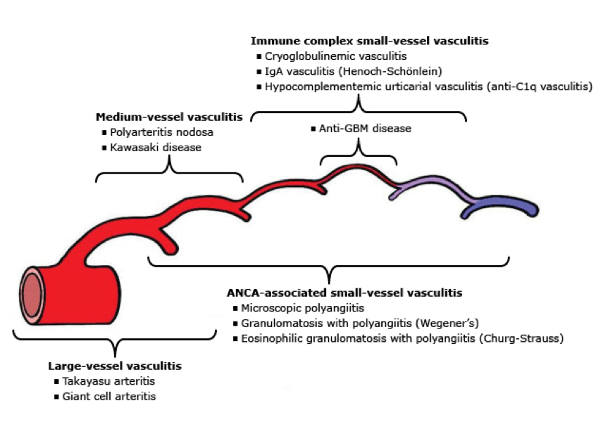

# Cardiac System & Cardiology

## Fetal Circulation

## Heart Development

|Mnemonic|Embryonic structure|Derivatives|
|-|-|-|
|Small|Sinus venosus|Smooth part of RA & Coronary sinus|
|Pump|Primitive atrium|Trabeculated part of RA & LA|
|Produces|Primitive ventricle|Trabeculated part of RV & LV|
|Big|Bulbus cordis|Smooth part of RV & LV|
|Turbulence|Truncus arteriosus|Aortic & Pulmonary trunk|

## Layers of Arteries

|Layer|Elastic Artery|Muscular Artery|Arteriole|
|-|-|-|-|
|Tunica adventitia|+|+|+|
|External elastic layer|-|Elastin|-|
|Tunica media|Elastin|Smooth muscle|Smooth muscle|
|Internal elastic layer|-|Elastin|-|
|Tunica intima|+|+|+|

## Action Potential of Cardiac Muscle Cells

|Phase|SA & AV Nodes|Atria & Ventricles|
|-|-|-|
|0|Ca current|Na current|
|1|-|K current|
|2|-|Ca & K current|
|3|K current|K current|
|4|Funny current: Na & K current|Leak current: K current|

## Factors Affecting Stroke Volume {CAP}

- Contractility
- Afterload
- Preload

## Cardiac & Vascular Function Curves

|Label|Examples|
|-|-|
|1|Catecholamines & Digitalis|
|2|Heart failure & Narcotics|
|3|Venopressors & Infusion|
|4|Venodilators & Hemorrhage & Spinal anesthesia|
|5|Vasopressors|
|6|Vasodilators & AV shunt|

## Heart Sounds

|Heart Sound|Synonym|Etiology|Pathology|Examples|
|-|-|-|-|-|
|S1|-|MV & TV closure|-|-|
|S2|-|AV & PV closure|-|-|
|S3|Ventricular gallop & Opening snap|MV & TV opening|Volume overload|HF & DCMP & MR & TR|
|S4|Atrial gallop & Atrial kick|Atrial contraction|Diastolic dysfunction|HF & HCMP|

## Splitting

|Type|Etiology|
|-|-|
|Normal|-|
|Wide|Pulmonary stenosis & RBBB|
|Fixed|ASD|
|Paradoxical|Aortic stenosis & LBBB|

## Hormones Acting on Vessels

|Hormone|Receptor|Effect|
|-|-|-|
|Norepinephrine|α1|Vasoconstriction|
|Epinephrine|β2|Vasodilation|
||α1|Vasoconstriction|
|Dopamine|D1|Vasodilation|
||α1|Vasoconstriction|
|Serotonin|5-HT1|Vasodilation Vasoconstriction|
||5-HT2|Vasoconstriction|
|Histamine|H1|Vasodilation|
|Angiotensin|AT1|Vasoconstriction|
|Vasopressin|V1|Vasoconstriction|
|Adenosine|A1|Vasodilation|
|Prostaglandin|PGE1|Vasodilation|
|Prostacyclin|PGI2|Vasodilation|
|Thromboxane|TXA2|Vasoconstriction|
|Endothelin|ETA|Vasoconstriction|
|Bradykinin|B1|Vasodilation|
|Substance P|NK1|Vasodilation|
|Nitric oxide|-|Vasodilation|

## Effects of Adrenergic Receptors

|Receptor|CO|SVR|MAP|
|-|-|-|-|
|α1|↓|↑ (1°)|↑|
|α2|↓|↓|↓|
|β1|↑ (1°)|-|↑|
|β2|↑|↓ (1°)|↓|

## Mechanisms of Action of Vasodilators

|Mechanism|Medication|
|-|-|
|K channel activators|Minoxidil Diazoxide|
|Ca channel blockers|-Dipines|
|α1 antagonists|Terazosin Doxazosin Prazosin|
|α2 agonists|Methyldopa Clonidine  Guanfacine|
|D1 agonists|Fenoldopam|
|A1 agonists|Adenosine|
|ETA antagonists|Bosentan|
|PDE inhibitors|Dipyridamole Cilostazol|
|Nitrates|Nitroprusside Hydralazine|

## Mechanisms of Action of Venodilators

|Mechanism|Medication|
|-|-|
|μ-opioid agonists|Morphine|
|Nitrates|Nitroglycerin Isosorbide|

## Mechanisms of Action of Inotropes

|Mechanism|Medication|
|-|-|
|Na-K pump blockers|Digitalis|
|β1 agonists|Norepinephrine Epinephrine Isoproterenol Dobutamine Dopamine|
|PDE inhibitors|Inamrinone Milrinone|

## Effects of Inotropes

|Inotrope|Mechanism|CO|SVR|MAP|IE|
|-|-|-|-|-|-|
|Norepinephrine|α1 > β1|-|↑ (1°)|↑|100|
|Epinephrine|β1 > β2 > α1|↑ (1°)|↓|↑|100|
|Isoproterenol|β1 = β2|↑ (1°)|↓ (1°)|-|100|
|Dobutamine|β1 > β2|↑ (1°)|↓|↑|1|
|Dopamine|D > β1 > α1|↑|↓ (1°)|↓|1|
|Inamrinone Milrinone|-|↑ (1°)|-|↑|15|

- Cardiac output (CO)
- Systemic vascular resistance (SVR)
- Mean arterial pressure (MAP)
- Inotropic equivalent (IE)

## Medications Slowing Conduction {ABCD}

- Adenosine
- Amiodarone
- β antagonists
- Ca channel blockers
- Digitalis

## Physical Examination for Cardiovascular System

|Finding|Indications|
|-|-|
|Kussmaul sign|Cardiac tamponade Right heart failure Restrictive cardiomyopathy|
|Pulsus paradoxus|Cardiac tamponade Obstructive lung diseases|
|Pulsus parvus et tardus|Aortic stenosis|
|Pulsus alternans|LV systolic dysfunction|
|Differential cyanosis|Eisenmenger syndrome of PDA|
|Reverse differential cyanosis|Transposition of great artery (TGA)|

## Grading of Murmurs

|Grade|Thrill|Stethoscope|
|-|-|-|
|1|-|Against|
|2|-|Against|
|3|-|Against|
|4|+|Against|
|5|+|Partially off|
|6|+|Completely off|

## Approach to ECG

- Rate
- Rhythm
- Axis
- Interval
- Morphology

## Localization on ECG

|Location|Artery|Leads|
|-|-|-|
|Septal|LAD|V1 & V2|
|Anterior|LAD|V3 & V4|
|Apical|LAD / LCX / RCA|V5 & V6|
|Lateral|LCX|I & aVL|
|Inferior|RCA & LCX|II & III & aVF|
|Posterior|RCA / LCX|V1 & V2 & V3|

## Views of Echocardiography

## Cardiac Stress Test

- Exercise :: treadmill & bicycle
- Dobutamine
- Vasodilators :: Dipyridamole & Adenosine

## Atrial Septal Defects (ASD)

|Type|Prevalence|
|-|-|
|Secundum|70%|
|Primum|20%|
|Sinus venosus|10%|
|Coronary sinus|< 1%|

.jpg)

## Ventricular Septal Defects (VSD)

.png)

## Cyanotic Congenital Heart Defects (CHD) {5T-HE}

|Defect|Obligatory Shunt|Cyanosis|
|-|-|-|
|Truncus arteriosus|-|Non-differential|
|Transposition of great artery (TGA)|(ASD / VSD) & PDA|Reverse differential|
|Tricuspid atresia|ASD & (VSD / PDA)|Non-differential|
|Tetralogy of Fallot (TOF)|VSD & PDA|Non-differential|
|Total anomalous pulmonary venous return (TAPVR)|ASD / VSD / PDA|Non-differential|
|Hypoplastic left heart syndrome (HLHS)|ASD & PDA|Non-differential|
|Eisenmenger syndrome of ASD|-|Non-differential|
|Eisenmenger syndrome of VSD|-|Non-differential|
|Eisenmenger syndrome of PDA|-|Differential|

## PDA-dependent Cyanotic Congenital Heart Defects (CHD)

- Transposition of great artery (TGA)
- Tetralogy of Fallot (TOF)
- Hypoplastic left heart syndrome (HLHS)
- Critical pulmonary stenosis
- Critical aortic stenosis
- Critical coarctation of the aorta (CoA)

## Heart Defects & Disease Associations

|Defect|Associations|
|-|-|
|Endocardial cushion defects|Down syndrome|
|Atrial septal defect (ASD)|Down syndrome Fetal alcohol syndrome|
|Ventricular septal defect (VSD)|Down syndrome Fetal alcohol syndrome VACTERL association Apert syndrome|
|Patent ductus arteriosus (PDA)|Congenital rubella|
|Tetralogy of Fallot (TOF)|DiGeorge syndrome Velocardiofacial syndrome|
|Mitral valve prolapse (MVP)|Ehlers-Danlos syndrome (EDS) Marfan syndrome Fragile X syndrome Rheumatic fever ADPKD|
|Supravalvular aortic stenosis|Williams syndrome|
|Bicuspid aortic value Coarctation of the aorta (CoA)|Turner syndrome|
|Ebstein anomaly|Lithium|
|Libman-Sacks endocarditis|Systemic lupus erythematosus (SLE)|
|Coronary artery aneurysms|Kawasaki disease|
|Aortic dissection|Ehlers-Danlos syndrome (EDS) Marfan syndrome Tertiary syphilis|

## Presentation of Tetralogy of Fallot (TOF) {PROV}

- Pulmonary stenosis
- RV hypertrophy
- Overriding aorta
- Ventricular septal defect

## Classification of Shock

|Shock|PCWP|CO|SVR|MAP|Treatment|
|-|-|-|-|-|-|
|Hypovolemic|↓ (1°)|↓|↑|↓|Fluids|
|Cardiogenic|↑|↓ (1°)|↑|↓|Inotropes Diuretics Venodilators|
|Distributive|-|↑|↓ (1°)|↓|Vasopressors|

## Types of Distributive Shock

- Anaphylactic shock
- Septic shock
- Neurogenic shock

## Classification of Hypovolemic Shock

|Class|Loss|HR|BP|RR|Urine|
|-|-|-|-|-|-|
|I|< 15%|< 100|-|12 ~ 20|> 30 mL/h|
|II|15 ~ 30%|100 ~ 120|-|20 ~ 30|20 ~ 30 mL/h|
|III|30 ~ 40%|120 ~ 140|↓|30 ~ 40|5 ~ 15 mL/h|
|IV|> 40%|> 140|↓|> 35|< 5 mL/h|

## Classification of Heart Failure (HF)

||HFrEF|HFpEF|
|-|-|-|
|LVEDV|↑|↓|
|LVESV|↑|↓|
|SV|↓|↓|
|LVEF|↓|-|
|Dysfunction|Systolic|Diastolic|
|Etiology|ACS & DCMP|HCMP & RCMP|

## Staging of Heart Failure (HF)

### NYHA

### ACC/AHA

## Treatment of Heart failure (HF)

### Decompensated {LMNOP}

- Diuretics :: Lasix
- Venodilators
  - Morphine
  - Nitrates
- Oxygen
- Position

### Compensated {ABVD}

- ACEI & ARB
- β1 antagonists
  - Carvedilol
  - Bisoprolol
  - Metoprolol
- Vasodilators :: Nitrates
- Digitalis
- Diuretics :: Spironolactone

## Etiology of Dilated Cardiomyopathy (DCMP) {ABCD}

- Alcohol
- Beriberi & Vitamin B1 deficiency
- Coxsackie B virus myocarditis
- Cocaine
- Chagas disease
- Doxorubicin
- Duchenne muscular dystrophy

## ECG Changes in Electrolyte Disturbances

### Hypokalemia

- Flattened T waves
- U waves

### Hyperkalemia

- Flattened P waves
- Widened QRS complexes
- Peaked T waves
- Sine waves

### Hypocalcemia

- Prolonged QT interval
- Bradycardia

### Hypercalcemia

- Shortened QT interval
- Tachycardia

## Etiology of Arrhythmia {HIS-BEDS}

- Hypoxia
- Ischemia
- Irritability
- Sympathetic tone
- Bradycardia
- Electrolyte disturbances
- Drugs
- Stretch

## Pathogenesis of Arrhythmias

- Automaticity
- Triggered activity
  - Early after-depolarization (EAD)
  - Delayed after-depolarization (DAD)
- Reentry
- Conduction delay

## Classification of Arrhythmias

### Sinus Arrhythmias

- Sinus bradycardia
- Sinus tachycardia

### Supraventricular Arrhythmias :: Atrial

- Atrial tachycardia (AT)
  - Focal atrial tachycardia (FAT)
  - Multifocal atrial tachycardia (MAT)
- Atrial flutter
- Atrial fibrillation (AF)

### Supraventricular Arrhythmias :: Junctional

- Junctional escape [Idiojunctional] rhythm
- Junctional tachycardia (JT)
- AV nodal reentrant tachycardia (AVNRT)
- AV reentrant/reciprocating tachycardia (AVRT)

### Ventricular Arrhythmias

- Ventricular escape [Idioventricular] rhythm
- Ventricular tachycardia (VT)
- Ventricular fibrillation (VF)

## Types of Pre-excitation

## Risk of Stroke from Atrial Fibrillation

### CHADS2 Score

- Congestive heart failure (CHF)
- Hypertension
- Age ≥ 75 years
- Diabetes mellitus
- Stroke / CVA history

### CHA2DS2-VASc Score

- Congestive heart failure (CHF)
- Hypertension
- Age ≥ 75 years
- Diabetes mellitus
- Stroke / CVA history
- Vascular diseases
- Age 65 ~ 75 years
- Sex :: female

## Treatment of Atrial Fibrillation

- Cardioversion
  - Hemodynamically unstable
  - Persistent
    - Duration < 48 hours
    - Anticoagulated
    - No atrial thrombus on TEE
- Anticoagulants
  - Duration > 48 hours
  - CHA2DS2-VASc ≥ 2
- Antiarrhythmics
  - Rate control :: Class 2 & 4 & Digitalis
  - Rhythm control :: Class 1C & 3

## Rules of Malignancy for PVC

- Frequent PVC
- Consecutive PVC
- R-on-T phenomenon
- Acute myocardial infraction
- Multiform PVC

## Etiology of QT Prolongation

- Drugs {ABCDE}
- Electrolyte disturbances
  - Hypokalemia
  - Hypocalcemia
  - Hypomagnesemia
- Congenital long QT syndrome

## Mechanisms of Action of Antiarrhythmics

|Mechanism|Medication|
|-|-|
|Class 1: Na channel blockers|Class 1A: Quinidine Procainamide Disopyramide|
||Class 1B: Lidocaine Mexiletine|
||Class 1C: Flecainide Propafenone|
|Class 2: β antagonists|-|
|Class 3: K channel blockers|Amiodarone Ibutilide Dofetilide Sotalol|
|Class 4: Ca channel blockers|Verapamil Diltiazem|
|Miscellaneous|Adenosine|Arrhythmia|
||Digitalis|Arrhythmia|
||Magnesium|Arrhythmia|

## Effects of Antiarrhythmics on ECG

|ECG|Heart|Phase|Ion Channel|Antiarrhythmics|
|-|-|-|-|-|
|Heart rate|SA node|4|Na & K|Class 2|
|PR interval|AV node|0|Ca|Class 2 & 4|
|QRS complex|Ventricle|0|Na|Class 1|
|QT interval|Ventricle|2 & 3|K|Class 1 & 3|

## Contraindications for Amiodarone

- Sinus bradycardia :: < 40 & symptomatic
- Sick sinus syndrome
- AV blocks :: 2nd & 3rd degree
- QT prolongation
- Wolff-Parkinson-White (WPW) syndrome
- Cardiogenic shock

## Indications for Defibrillation

- VF: 120 ~ 200 J
- Pulseless VT: 120 ~ 200 J
- Unstable polymorphic VT: 120 ~ 200 J

## Indications for Synchronized Cardioversion

- Unstable narrow-QRS tachycardia: 50 ~ 100 J
- Unstable atrial flutter: 50 ~ 100 J
- Unstable atrial fibrillation: 120 ~ 200 J
- Unstable monomorphic VT: > 100 J

## Indications for Permanent Pacemaker

- Sinus bradycardia :: < 40/min & symptomatic
- Sick sinus syndrome
- AV blocks :: 2nd degree Mobitz II & 3rd degree

## Etiology of ST Segment Elevation

- Acute myocardial infarction
- Acute myocarditis
- Acute pericarditis
- Apical ballooning syndrome
- Brugada syndrome
- Hyperkalemia
- Hypothermia
- J point elevation
- Pulmonary embolism
- Variant angina

## Coronay Artery Disease (CAD)

|Type|Pathogenesis|T Wave|ST Segment|Q Wave|Triggers|Cardiac Enzymes|
|-|-|-|-|-|-|-|
|Variant [Prinzmetal] angina|Coronary artery spasm|HTW|STE|-|Drugs|-|
|Stable angina|Coronary artery thrombosis|-|STD|-|Exertion|-|
|Unstable angina|Coronary artery thrombosis|TWI|STD|-|Anytime|-|
|NSTEMI [NQMI]|Subendocardial infarction|TWI|STD|-|Anytime|↑|
|STEMI [QWMI]|Transmural infarction|HTW|STE|PQW|Anytime|↑|

## Risk Factors for Coronay Artery Disease (CAD)

- Elderly
  - Age ≥ 45 years in males
  - Age ≥ 55 years in females
- Family history
- Hypertension
- HDL < 40 mg/dL
- Cigarette smoking

## Complications of Myocardial Infarction

|Time (days)|Histology|Complications|
|-|-|-|
|< 1|Coagulative necrosis Contraction bank Wavy fiber|Cardiogenic shock Arrhythmia Heaert failure|
|1 ~ 3|-|Fibrinous pericarditis|
|3 ~ 14|Granulation tissue|Pseudo-aneurysm Free wall rupture Papillary muscle rupture|
|> 14|Contracted scar|Aneurysm Mural thrombus Dressler syndrome|

## Thrombolysis in Myocardial Infarction (TIMI) Score for NSTEMI {ACS}

- Age > 65 years
- Aspirin use
- Angina ≥ 2 in 24 hours
- CAD history
- CAD risk factors ≥ 3
- Cardiac enzymes
- ST changes > 0.5 mm

## Treatment of Acute Coronary Syndrome (ACS) {MONA}

- Oxygen
- Venodilators
  - Morphine
  - Nitrates
- Antiplatelets
  - Aspirin
  - ADP antagonists
- Anticoagulants :: Heparin
- β1 antagonists
- Revascularization
  - Thrombolysis: duration < 12 ~ 24 hours
  - Percutaneous intervention (PCI)
  - Coronary artery bypass grafting (CABG)

## Ideal Door-to-Reperfusion Time for ACS

- Door-to-needle < 30 minutes
- Door-to-bolloon < 90 minutes

## Indications for Coronary Artery Bypass Grafting (CABG)

- LCA > 50% stenosis
- Proximal LAD > 50% stenosis
- 2-vessel disease: 2 vessels > 50% stenosis & EF < 50%
- 3-vessel disease: 3 vessels > 50% stenosis

## Types of Grafts for Coronary Artery Bypass Grafting (CABG)

- Saphenous vein graft
- Internal mammary artery (IMA) graft
  - Left internal mammary artery (LIMA) graft
  - Right internal mammary artery (RIMA) graft
- Radial artery graft

## Comparison Between Biosprosthetic and Mechanical Heart Valves

- Mortality: biosprosthetic > mechanical
- Durability: biosprosthetic < mechanical
- Bleeding: biosprosthetic < mechanical
- Thromboembolism: biosprosthetic < mechanical

## Beck Triad of Cardiac Tamponade

- Hypotension & Pulsus paradoxus
- Jugular vein distension (JVD) & Kussmaul sign
- Distant heart sound

## Blood Pressure

- Hypotension: BP < 90/60 mmHg
- Hypertension: BP > 140/90 mmHg
- Hypertensive urgency: BP > 180/120 mmHg

## Treatment of Hypertension {ABVD}

- ACEI & ARB
- β1 antagonists
- Vasodilators
- Diuretics

## Treatment of Hypertensive Emergency

- β1 antagonists :: Labetalol
- Venodilators & Vasodilators
  - Nitrates
  - Ca channel blockers

## Thromboembolic Diseases

### Arterial Thromboembolism

- Coronary artery disease (CAD)
- Carotid artery stenosis (CAS)
- Renal artery stenosis (RAS)
- Peripheral artery disease (PAD)
  - Chronic limb ischemia (CLI)
  - Acute limb ischemia (ALI)
- Intestinal ischemia (II)
- Ischemic stroke (IS)

### Venous Thromboembolism

- Pulmonary embolism (PE)
- Deep vein thrombosis (DVT)
- Cavernous sinus thrombosis (CST)
- Hepatic vein thrombosis

## Revascularization Techniques

|Technique|Indications|
|-|-|
|Thrombolysis|PE & DVT & CST & CAD & ALI & II & IS|
|Thrombectomy|PE & DVT & CST & CAS & ALI & II & IS|
|Angioplasty|CAD & CAS & RAS & CLI & II|
|Bypass surgery|CAD & CAS & RAS & CLI & II|

## Fontaine Staging of Peripheral Artery Disease (PAD)

|Stage|Symptoms|
|-|-|
|1|Asymptomatic|
|2|Intermittent claudication|
|3|Ischemic rest pain|
|4|Ulceration & Gangrene|

.png)

## Treatment of Peripheral Artery Disease (PAD)

- PDE inhibitors :: Cilostazol
- Antiplatelets
  - Aspirin
  - ADP antagonists
- Anticoagulants :: Heparin
- Revascularization
  - Percutaneous transluminal angioplasty (PTA)
  - Arterial bypass surgery

## Vasculitis

### Large-vessel

- Takayasu arteritis
- Giant cell arteritis [Temporal arteritis]

### Medium-vessel

- Kawasaki disease
- Polyarteritis nodosa
- Thromboangiitis obliterans [Buerger disease]

### Small-vessel

- ANCA-associated vasculitis (AAV)
- IgA vasculitis [Henoch-Schonlein purpura (HSP)]
- Cryoglobulinemic vasculitis

## ANCA-associated vasculitis (AAV)

|Vasculitis|Antibodies|Affected Organs|
|-|-|-|
|Granulomatosis with polyangiitis (GPA) [Wegener granulomatosis]|PR3-ANCA [c-ANCA]|Nasopharynx & Sinus & Lung & Kidney|
|Eosinophilic granulomatosis with polyangiitis (EGPA) [Churg-Strauss syndrome]|MPO-ANCA [p-ANCA]|Sinus & Asthma & Kidney & Nerve|
|Microscopic polyangiitis|MPO-ANCA [p-ANCA]|Lung & Kidney|

## Presentation of Kawasaki Disease {F-SCARE}

- Fever :: > 40°C for > 5 days
- Strawberry tongue
- Conjunctivitis
- Adenopathy :: neck
- Rashes :: desquamating
- Edema :: limbs

## Presentation of Hereditary Hemorrhagic Telangiectasia (HHT)

- Telangiectasia
- Epistaxis
- Cerebral AVM
- Pulmonary AVM
- Paradoxical embolism

## Pathogens of Infective Endocarditis

- Staphylococcus aureus
- Staphylococcus epidermidis
- Streptococcus viridans
- Enterococcus
- Pseudomonas aeruginosa
- Candida

## Pathogens of Culture-Negative Infective Endocarditis {HACEK}

- Haemophilus parainfluenzae
- Actinobacillus
- Cardiobacterium
- Eikenella
- Kingella

## Presentation of Infective Endocarditis {FROM-JANE}

- Fever
- Roth spots
- Osler nodes
- Murmur
- Janeway lesions
- Anemia
- Nail-bed hemorrhage
- Emboli

## Duke Criteria for Infective Endocarditis

### Major

- Microbiological evidence
- Endocardial involvement

### Minor

- Fever
- Vascular phenomena
- Immunologic phenomena
- Microbiological evidence
- Risk factors

## Empirical Antibiotics for Infective Endocarditis

- Anti-MRSA
- Gentamycin Anti-pseudomonal β-lactams
