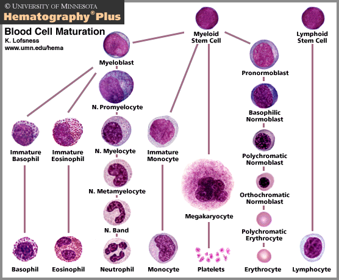

# Hematopoietic System & Hematology

## Hematopoiesis

## Granules in Blood Cells

|Cell|Granule|Contents|
|-|-|-|
|Neutrophil|Specific granule|Leukocyte alkaline phosphatase (LAP) Collagenase Lactoferrin|
||Azurophilic granule|Proteinases Acid phosphatase Myeloperoxidase β-glucuronidase|
|Eosinophil|Eosinophilic granule|Histaminase Major basic protein (MBP) Eosinophil peroxidase Eosinophil cationic protein|
|Basophil|Basophilic granule|Heparin Histamine|
|Platelet|α granule|vWF Fibrinogen Fibronectin Platelet factor 4 (PF4)|
||Dense granule|Calcium ADP Serotonin Histamine|

## Erythropoiesis

|Mnemonic|Site|
|-|-|
|Young|York sac|
|Liver|Liver|
|Synthesizes|Spleen|
|Blood|Bone marrow|

## Heme Synthesis

## Hemoglobin Genes

## Hemoglobin Variants

||α-Globin|Disease|α-Globin Defect|Disease|
|-|-|-|-|-|
|β-Globin|α2β2 [HbA]|-|β4 [HbH]|α-thalassemia :: 3 deletion|
|γ-Globin|α2γ2 [HbF]|β-thalassemia major|γ4 [Hb Barts]|α-thalassemia :: 4 deletion|
|δ-Globin|α2δ2 [HbA2]|β-thalassemia minor|-|-|
|s-Globin|α2s2 [HbS]|Sickle cell disease|-|-|
|c-Globin|α2c2 [HbC]|HbC disease|-|-|

## WBC Differential Counts

|Mnemonic|Cell|Ratio|
|-|-|-|
|Neutrophils|Neutrophil|60%|
|Like|Lymphocyte|30%|
|Making|Monocyte|6%|
|Everything|Eosinophil|3%|
|Better|Basophil|1%|

## Etiology of Target Cells {HALT}

- HbC disease
- Asplenia
- Liver disease
- Thalassemia

## Coombs Tests

## Etiology of Anemia

### Microcytic Anemia {TAILS}

|Anemia|Fe|Ferritin|Transferrin [TIBC]|Saturation = Fe ÷ TIBC|Defect|
|-|-|-|-|-|-|
|Thalassemia|-|-|-|-|Hemoglobin|
|Anemia of chronic disease (ACD)|↓|↑|↓|-|Fe|
|Iron deficiency anemia (IDA)|↓|↓|↑|↓|Fe|
|Lead poisoning|↑|↑|↓|↑|Heme|
|Sideroblastic anemia|↑|↑|↓|↑|Heme|

- Thalassemia
- Anemia of chronic disease (ACD)
- Iron deficiency anemia (IDA)
- Lead poisoning
- Sideroblastic anemia
  - Alcoholism
  - ALA synthase deficiency
  - Vitamin B6 deficiency
  - Copper deficiency

### Normocytic Anemia :: Non-hemolytic Anemia

- Aplastic anemia
- Chronic kidney disease (CKD)

### Normocytic Anemia :: Hemolytic Anemia

||Intravascular|Extravascular|
|-|-|-|
|Peripheral smear|Schistocyte|Spherocyte|
|Haptoglobin|↓|-|
|Hemoglobin|↑|-|
|Hematuria|+|-|
|Indirect bilirubin|-|↑|
|Direct bilirubin|-|-|
|Urine bilirubin|-|-|
|Urine urobilinogen|-|↑|
|LDH|↑|↑|
|Jaundice|-|+|

#### Intravascular Hemolytic Anemia {TIMP}

- Transfusion
- Infusion
- Macroangiopathic hemolytic anemia (MAHA)
- Microangiopathic hemolytic anemia (MAHA)
  - Disseminated intravascular coagulation (DIC)
  - Thrombotic thrombocytopenic purpura (TTP)
  - Hemolytic uremic syndrome (HUS)
  - HELLP syndrome
- Paroxysmal nocturnal hematuria (PNH)

#### Extravascular Hemolytic Anemia {PHAGES}

- Pyruvate kinase deficiency
- HbC disease
- Hereditary spherocytosis
- Autoimmune hemolytic anemia (AHA)
- G6PD deficiency
- Elliptocytosis
- Sickle cell disease (SCD)

### Macrocytic Anemia :: Megaloblastic

- Folate deficiency
- Vitamin B12 deficiency
- Orotic aciduria
- Fanconi anemia

### Macrocytic Anemia :: Non-megaloblastic

- Diamond-Blackfan anemia
- Alcoholism
- Reticulocytosis

## Etiology of Elevated RDW

- Iron deficiency anemia (IDA)
- Folate deficiency anemia
- Vitamin B12 deficiency anemia
- Mixed anemia

## Comparison Between Thalassemia and IDA

||Thalassemia|IDA|
|-|-|-|
|Mentzer index = MCV ÷ RBC|< 13|> 13|
|RDW|-|↑|
|Iron profile|Normal|Abnormal|
|Blood smear|Target cells|-|

## Subtypes of Porphyria

- Acute intermittent porphyria (AIP)
- Porphyria cutanea tarda (PCT)
- Erythropoietic protoporphyria (EPP)

## Presentation of Acute Intermittent Porphyria (AIP) {5P}

- Pain :: abdomen
- Port wine-colored urine
- Polyneuropathy
- Psychological disturbances
- Precipitation
  - Starvation
  - Alcohol
  - Cytochrome P-450 (CYP450) inducers

## Etiology of Aplastic Anemia

- Fanconi anemia
- Virus
  - Parvovirus B19
  - EBV
  - CMV
  - HIV
  - Hepatitis virus
- Drugs
  - Carbamazepine
  - Methimazole
  - Propylthiouracil
  - NSAIDs
  - Chloramphenicol
- Toxins :: Benzene
- Radiation

## Presentation of Sickle Cell Disease (SCD)

- Vaso-occlusive crisis (VOC)
- Acute chest syndrome
- Mesenteric ischemia
- Ischemic stroke
- Hemolysis :: extravascular
- Splenic sequestration
- Aplastic crisis
- Avascular necrosis
- Osteomyelitis
- Dactylitis
- Priapism

## Triggers of Vaso-occlusive Crisis (VOC) in Sickle Cell Disease (SCD)

- Dehydration
- Infection
- Hypoxia
- Cold temperatures

## Management of Sickle Cell Disease (SCD)

- Immunizations
- Penicillin prophylaxis
- Folate supplementation
- Transfusion
- Hemapheresis
- Hydroxyurea
- Bone marrow transplantation

## Treatment of Polycythemia

- Phlebotomy
- Antiplatelets :: Aspirin
- Cytoreductive agents
  - Hydroxyurea
  - Interferon
  - Busulfan

## Types of Transfusion Reactions

|Type|Causes|Onset|
|-|-|-|
|Allergic|Anti-plasma proteins IgE Anti-IgA IgE|Minutes ~ Hours|
|Hemolytic (HTR)|Anti-ABO Anti-Rh|Minutes ~ Days|
|Febrile non-hemolytic (FNHTR)|Cytokines|Hours|

## Leukemia & Lymphoma

### Myeloid Leukemia

|Tumor|Mutation|Gene|
|-|-|-|
|AML|t(15;17)|PML/RARA|
||t(8;21)|RUNX1/RUNX1T1|
||t(16;16)|CBFB/MYH11|
||-|NPM1|
||-|CEBPA|
||-|FLT3|
|CML|t(9;22)|BCR/ABL1|

- Acute myelogenous leukemia (AML)
- Chronic myelogenous leukemia (CML)

### Lymphoid Leukemia

|Tumor|Mutation|Gene|
|-|-|-|
|ALL|t(12;21)|ETV6/RUNX1|
||t(1;19)|TCF3/PBX1|
||t(9;22)|BCR/ABL1|
||t(4;11)|MLL/AF4|
||Hyperdiploidy > 50|-|
||Hypodiploidy < 44|-|
|CLL|-|-|
|HCL|-|-|

- Acute lymphocytic leukemia (ALL)
- Chronic lymphocytic leukemia (CLL)
- Hairy cell leukemia (HCL)

### T-cell Lymphoma

|Tumor|Mutation|Gene|
|-|-|-|
|Adult T-cell lymphoma|-|-|
|Cutaneous T-cell lymphoma|-|-|

### B-cell Lymphoma

|Tumor|Mutation|Gene|
|-|-|-|
|Hodgkin lymphoma|-|-|
|Burkitt lymphoma|t(8;14)|C-MYC/IGH|
|Diffuse large B-cell lymphoma (DLBCL)|-|-|
|Marginal zone lymphoma MALT lymphoma (MALToma)|-|-|
|Mantle cell lymphoma|t(11;14)|Cyclin D (CCND)|
|Follicular lymphoma|t(14;18)|BCL2|

## Workup of Leukemia

- Peripheral blood smear
- Bone marrow smear
- Cytochemistry
- Immunophenotyping
- Karyotyping
- Genotyping

## B Symptoms of Lymphoma

- Fever
- Night sweats
- Weight loss

## Treatment of Leukemia

|Leukemia|Treatment|
|-|-|
|AML|Anthracyclines Cytarabine All-trans retinoic acid (ATRA)|
|CML|Imatinib|
|ALL|-|
|CLL|Fludarabine Cyclophosphamide Rituximab|
|HCL|Cladribine|

## Treatment of Hodgkin Lymphoma {ABVD}

- Doxorubicin [Adriamycin]
- Bleomycin
- Vinblastine
- Dacarbazine

## Treatment of B-cell Non-Hodgkin Lymphoma {R-CHOP}

- Rituximab
- Cyclophosphamide
- Doxorubicin [Hydroxydaunorubicin]
- Vincristine [Oncovin]
- Prednisolone

## Causes of Monoclonal Spike [M Spike]

- Multiple myeloma
- Waldenström macroglobulinemia
- Monoclonal gammopathy of undetermined significance (MGUS)
- AL amyloidosis

## Presentation of Multiple Myeloma {CRAB}

- Hypercalcemia
- Renal failure
- Rouleaux formation
- Russell body
- Anemia
- Amyloidosis :: primary
- Back pain
- Bone lesions
- Bence-Jones protein

## Diagnostic Tests for Multiple Myeloma

- Protein electrophoresis
- Bone marrow biopsy
- Skeletal survey

## Diagnosis of Multiple Myeloma

- Histology of bone marrow
  - Clonal bone marrow plasma cells > 10%
  - Plasmacytoma
- Evidence of end-organ damages {CRAB}
  - Hypercalcemia
  - Renal failure
  - Anemia
  - Bone lesions
- Evidence of inevitable end-organ damages
  - Free light chain (FLC) ratio > 100
  - Clonal bone marrow plasma cell > 60%
  - Bone lesions on MRI > 1

## Presentation of Hemophagocytic Lymphohisticytosis (HLH)

- Fever
- ↑ Ferritin
- Hypertriglyceridemia
- Hemophagocytosis
- NK cell activity decreased
- Pancytopenia
- Rashes
- Splenomegaly

## Myeloproliferative Disorders

|Tumors|Genetics|RBC|WBC|PLT|
|-|-|-|-|-|
|Polycythemia vera|JAK2|↑|↑|↑|
|Chronic myelogenous leukemia (CML)|t(9;22)|↓|↑|↑|
|Essential thrombocytosis|JAK2|-|-|↑|
|Myelofibrosis|JAK2|↓|↑/↓|↑/↓|

## Coagulation Pathway

## Enzymes Targeting Coagulation Factors

|Enzyme|Targets|
|-|-|
|VKOR|↑ Factor 2 & **7** & 9 & 10 & **Protein C/S**|
|Antithrombin|↓ Factor **2** & 7 & 9 & **10** & 11 & 12|
|Protein C/S|↓ Factor 5 & 8|
|Plasmin|↓ Factor 1|

## Virchow Triad for Thrombosis {SHE}

|Cause|Effect|
|-|-|
|Stasis|VTE|
|Hypercoagulability|ATE / VTE|
|Endothelial injury|ATE|

## Etiology of Hypocoagulability

|Etiology|Mechanism|PLT|BT|PT|PTT|Clots|
|-|-|-|-|-|-|-|
|Disseminated intravascular coagulation (DIC)|-|↓|↑|↑|↑|+|
|Thrombotic thrombocytopenic purpura (TTP)|↓ ADAMTS13|↓|↑|-|-|+|
|Hemolytic uremic syndrome (HUS)|↓ ADAMTS13 Shiga-like toxin|↓|↑|-|-|+|
|HELLP syndrome|-|↓|↑|-|-|-|
|Immune thrombocytopenic purpura (ITP)|Anti-Gp1b Anti-Gp2b/3a|↓|↑|-|-|-|
|Heparin-induced thrombocytopenia (HIT)|Anti-platelet factor 4 (Anti-PF4)|↓|↑|-|-|+|
|Antiphospholipid syndrome (APS)|Anti-cardiolipin Anti-β2-glycoprotein I Lupus anticoagulant|-|-|-|↑|+|
|Von Willebrand disease (VWD)|↓ vWF|-|↑|-|↑|-|
|Bernard-Soulier disease (BSD)|↓ Gp1b|-|↑|-|-|-|
|Glanzmann disease|↓ Gp2b/3a|-|↑|-|-|-|
|Hemophilia A & B & C|↓ Factor 8 & 9 & 11|-|-|-|↑|-|
|Vitamin K deficiency|↓ Factor 2 & 7 & 9 & 10|-|-|↑|↑|-|
|Cirrhosis|↓ Thrombopoietin (TPO) ↓ Factors|↓|↑|↑|-|-|

## Etiology of Hypercoagulability

|Etiology|Mechanism|
|-|-|
|Homocysteinemia|↑ Factor 7|
|Factor 5 Leiden mutation|↑ Factor 5|
|Prothrombin gene mutation|↑ Factor 2|
|Antithrombin deficiency|↓ Antithrombin|
|Protein C/S deficiency|↓ Protein C/S|
|Nephrosis|↓ Protein C/S|
|Pregnancy|↑ Factor 1|

## Mechanisms of Action of Antiplatelets

|Mechanism|Medication|
|-|-|
|Gp2b/3a inhibitors|Abciximab Eptifibatide Tirofiban|
|ADP antagonists|Clopidogrel Prasugrel Ticagrelor Ticlopidine|
|PDE inhibitors|Dipyridamole Cilostazol|
|COX inhibitors|NSAIDs|

## Mechanisms of Action of Anticoagulants

|Mechanism|Medication|
|-|-|
|VKOR inhibitors|Warfarin Coumadin|
|Antithrombin inducers|Unfractionated heparin (UFH)|
||Low-molecular-weight heparin (LMWH): Enoxaparin Dalteparin|
||Fondaparinux|
|Factor 10a inhibitors|Apixaban Edoxaban Rivaroxaban|
|Factor 2a inhibitors|Hirudin Bivalirudin Argatroban Dabigatran|
|Tissue plasminogen activators (tPAs)|Urokinase Streptokinase Alteplase Reteplase Tenecteplase|

## Heparin Variants

||UFH|LMWH|
|-|-|-|
|Bioavailability|-|↑|
|Half-life|-|↑|
|Specificity to Factor 10a|-|↑|
|Monitor|PTT|-|
|Side Effect|HIT & Osteoporosis|-|
|Antidote|Protamine sulfate|-|

## Goal INR

|Condition|Goal|
|-|-|
|Venous thromboembolism (VTE)|2.0 ~ 3.0|
|Atrial fibrillation|2.0 ~ 3.0|
|Bioprosthetic valve|2.0 ~ 3.0|
|Mechanical valve|2.5 ~ 3.5|

## Etiology of Disseminated Intravascular Coagulation (DIC)

|Mnemonic|Cause|
|-|-|
|S|Sepsis :: GNB|
|T|Trauma|
|O|Obstetric complications|
|P|Pancreatitis :: acute|
|Making|Malignancy|
|New|Nephrotic symdrome|
|Thrombi|Transfusion|

## Pentad of Thrombotic Thrombocytopenic Purpura (TTP)

- Renal symptoms
- Anemia
- Thrombocytopenia
- Neurologic symptoms
- Fever

## Treatment of Thrombotic Thrombocytopenic Purpura (TTP)

- Plasmapheresis
- Immunosuppression
  - Steroids
  - Rituximab

## Triad of Hemolytic Uremic Syndrome (HUS)

- Renal symptoms
- Anemia
- Thrombocytopenia

## Treatment of Immune Thrombocytopenic Purpura (ITP)

- Immunosuppression
  - Steroids
  - Rituximab
- Intravenous immunoglobulin (IVIG)
- Splenectomy

## Indications for Thrombolytics

- ST-elevation myocardial infarction (STEMI)
  - Duration < 12 ~ 24 hours
  - Door-to-bolloon > 2 hours
- Ischemic stroke
  - Duration < 3 ~ 4.5 hours
  - BP < 185/110 mmHg
- Pulmonary embolism (PE)
  - Hemodynamically unstable

## Contraindications for Thrombolytics

- Intracranial hemorrhage
- Internal bleeding
- Bleeding tendency

## Plasma Products

- Fresh frozen plasma (FFP)
- Prothrombin complex concentrate (PCC)
- Cryoprecipitate
- Factor concentrate

## Indications of Plasma Products

|Product|Indications|
|-|-|
|FFP / PCC|Warfarin toxicity|
|Cryoprecipitate|Fibrinogen deficiency Hemophilia A Von Willebrand disease (VWD) Uremic bleeding|
|Factor concentrate|Factor deficiency|

## Amyloidosis

|Disease|Amyloid|Precursor|
|-|-|-|
|Primary amyloidosis|Amyloid light-chain (AL)|Immunoglobulin light-chain|
|Secondary amyloidosis|Amyloid A (AA)|Serum amyloid A (SAA)|
|Dialysis-related amyloidosis|Amyloid β2-microglobulin (Aβ2M)|β2-microglobulin (β2M)|
|DM type 2|Amyloid islet amyloid polypeptide (AIAPP)|Islet amyloid polypeptide (IAPP)|
|Alzheimer disease|Amyloid β (Aβ)|Amyloid precursor protein (APP)|
|Creutzfeldt-Jakob disease|Amyloid prion protein (APrP)|Prion protein (PrP)|
|Familial amyloidosis|Amyloid transthyretin (ATTR)|Transthyretin (TTR)|
