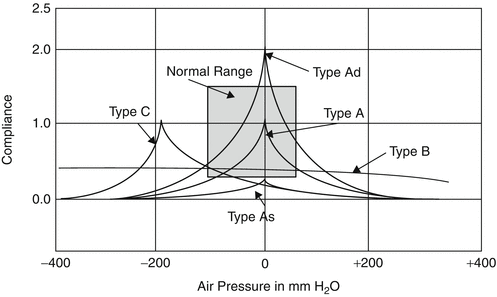

# Special Senses & Ophthalmology & Otolaryngology

## Layers of Cornea

- Epithelium
- Bowman's membrane
- Stroma
- Descemet's membrane
- Endothelium

## Visual Pathway

## Pupillary Reflex

## Conjugate Gaze

- Frontal eye fields (FEF)
- Paramedian pontine reticular formation (PPRF)
- Medial longitudinal fasciculus (MLF)

## Vestibulo-ocular Reflex

## Fundoscopic findings

|Finding|Diseases|
|-|-|
|Cherry-red spots|Retinal artery occlusion Lysosomal storage diseases (LSD)|
|Cotton-wool spots|Diabetic retinopathy Hypertensive retinopathy Retinal vein occlusion CMV retinitis|
|Drusen|Age-related macular degeneration (AMD)|
|Optic nerve cupping|Open-angle glaucoma|

## Etiology of Ophthalmoplegia & Nystagmus

|Lesion|Presention|Etiology|
|-|-|-|
|Inner ear|Peripheral vertigo|Vestibular disorders|
|CN VIII|Bruns nystagmus|Cerebellopontine angle tumors|
|Superior colliculus|Vertical gaze palsy|Parinaud syndrome|
|Frontal eye fields (FEF) Paramedian pontine reticular formation (PPRF)|Horizontal gaze palsy|-|
|Medial longitudinal fasciculus (MLF)|Internuclear ophthalmoplegia (INO)|Multiple sclerosis|
|CN III|Down-and-out gaze|Cavernous sinus thrombosis Posterior communicating artery aneurysm Uncal herniation|
|Extraocular muscles|-|Myasthenic syndrome Thyroid ophthalmopathy|
|Mammillary body|-|Wernicke encephalopathy|
|-|-|Epilepsy Stroke Migraine Chiari malformation|

## Presentation of Parinaud Syndrome

- Vertical gaze palsy
- Convergence-retraction nystagmus
- Light-near dissociation
- Collier sign

## Etiology of Miosis

- Drug-induced
  - ACh esterase inhibitors
  - M agonists
  - α2 agonists
  - Opioids
- Cluster headaches
- Horner syndrome

## Etiology of Mydriasis

- Drug-induced
  - M antagonists
  - NDRIs
- CN III damage
  - Cavernous sinus thrombosis
  - Posterior communicating artery aneurysm
  - Uncal herniation
- ↑ Intracranial pressure (ICP)
  - Intracranial hemorrhage
  - Cerebral edema
- ↑ Intraocular pressure (IOP)

## Presentation of Glaucoma

- Headache
- Nausea ± vomiting
- Visual disturbances
- Non-reactive pupil
- Mydriasis

## Medications for Glaucoma

|Mechanism|Medication|
|-|-|
|ACh esterase inhibitors|Organophosphate Sarin|
|M agonists|Carbachol Pilocarpine|
|α2 agonists|Brimonidine|
|β antagonists|Timolol|
|PGF2 agonists|Latanoprost|
|Carbonic anhydrase inhibitors|Acetazolamide|

## Treatment of Dry Eye Disease (DED)

- Cyclosporine :: topical
- Lifitegrast :: topical
- Corticosteroids :: topical
- Pilocarpine
- Punctal occlusion
- Autologous serum tears

## Auditory Pathway

## Acoustic Reflex

## Physical Examinations for Hearing Loss

|Hearing Loss|Rinne Test|Weber Test|
|-|-|-|
|Normal|AC > BC|Left = Right|
|Sensorineural|AC > BC|Lesion < Normal|
|Conductive|AC < BC|Lesion > Normal|

- Air conduction (AC)
- Bone conduction (BC)

## Symbols of Audiogram

||Right|Left|
|-|-|-|
|Unmasked AC|○|☓|
|Unmasked BC|<|>|
|Masked AC|△|□|
|Masked BC|⊏|⊐|

## Examples of Audiogram

### Normal

### Conductive Hearing Loss

### Sensorineural Hearing Loss

### Mixed Hearing Loss

### Noise-induced Hearing Loss

### Presbycusis

### Meniere Disease

### Osteosclerosis

## Tympanometry

|Type|Interpretation|
|-|-|
|A|Normal|
|Ad|Ossicular chain dislocation|
|As|Tympanosclerosis|
|B|Perforation|
|C|Eustachian tube dysfunction|

## Etiology of Peripheral Vertigo

- Benign paroxysmal positional vertigo (BPPV)
- Labyrinthitis
- Labyrinthine concussion
- Meniere disease
- Vestibular neuritis
- Vestibular schwannoma

## Pathogens of Otitis Externa

- Enterobacter
- Pseudomonas

## Pathogens of Otitis Media {SHM}

- Streptococcus pneumonia
- Haemophilus influenzae
- Moraxella catarrhalis

## Arterial Supply of the Nasal Septum

## Treatment of Nonallergic Rhinitis (NAR)

- Intranasal corticosteroids
- Intranasal H1 antagonists
- Oral H1 antagonists

## Pathogens of Sinusitis {SHM}

- Streptococcus pneumonia
- Haemophilus influenzae
- Moraxella catarrhalis
- Mucor and Rhizopus

## Pathogens of Pharyngitis & Tonsillitis

- Group A streptococcus (GAS)
- Adenovirus
- HSV
- EBV
- CMV
- HIV
- Parainfluenza virus
- Influenza virus
