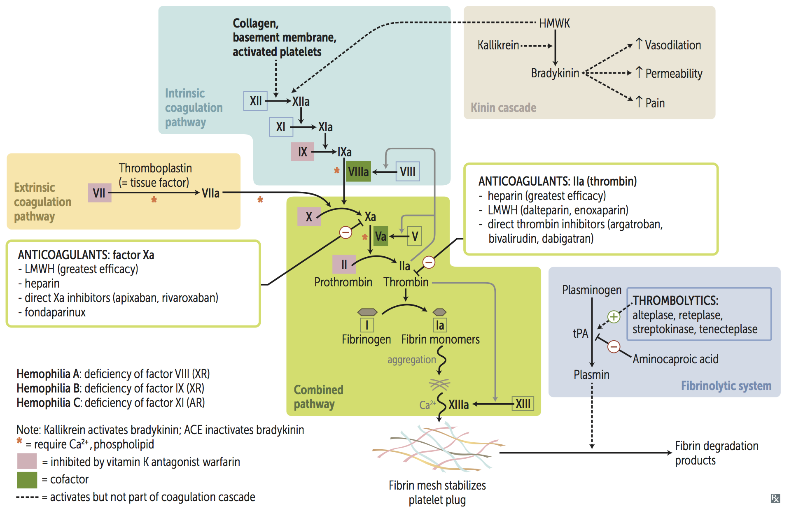

# Hematolymphoid System

## Leukocyte Dysfunctions

|Step|Endothelium|Leukocyte|Disease|
|-|-|-|-|
|Adhesion|CAM|Integrin|Leukocyte adhesion deficiency (LAD)|
|Fusion|-|Microtubule|Chediak-Higashi syndrome (CHS)|
|Degradation|-|NADPH oxidase|Chronic granulomatous disease (CGD)|
||-|Myeloperoxidase|Myeloperoxidase deficiency|

## Presentation of Chediak-Higashi Syndrome (CHS)

- Lymphohistiocytosis
- Albinism :: partial
- Recurrent infections
- Neurodegeneration
- Peripheral neuropathy

## Immunodeficiency {WASH-CHILD-CBS}

### Combined Deficiency {WASH}

|Disease|Gene|Inheritance|IgM|IgG|IgE|IgA|
|-|-|-|-|-|-|-|
|Wiskott-Aldrich syndrome (WAS)|WAS|XR|↓|-|↑|↑|
|Ataxia telangiectasia|ATM|AR|-|↓|↓|↓|
|Severe combined immunodeficiency (SCID)|ADA|AR|↓|↓|↓|↓|
||IL-2R|XR|↓|↓|↓|↓|
|Hyper-IgM syndrome|CD40L|XR|↑|↓|↓|↓|

### T Cell Deficiency {CHILD}

|Disease|Gene|Inheritance|IgM|IgG|IgE|IgA|
|-|-|-|-|-|-|-|
|Chronic mucocutaneous candidiasis|AIRE|AR|-|-|-|-|
|Hyper-IgE [Job] syndrome|STAT3|AD|-|-|↑|-|
|IL-12R deficiency|IL-12R|AR|-|-|-|-|
|DiGeorge syndrome|22q11|AD|-|-|-|-|

### B Cell Deficiency {CBS}

|Disease|Gene|Inheritance|IgM|IgG|IgE|IgA|
|-|-|-|-|-|-|-|
|Common variable immunodeficiency (CVID)|-|-|↓|↓|↓|↓|
|Bruton agammaglobulinemia|BTK|XR|↓|↓|↓|↓|
|Selective IgA deficiency|-|-|-|-|-|↓|

## Presentation of Wiskott-Aldrich syndrome (WAS) {WATER}

- Wiskott
- Aldrich
- Thrombocytopenia
- Eczema ← ↑ IgE & IgA
- Recurrent infections

## Presentation of Hyper-IgE [Job] Syndrome {FATE}

- Facies :: coarse
- Abscess
- Teeth :: primary
- Eosinophilia
- Eczema ← ↑ IgE

## Gell-Coombs Classification of Hypersensitivity {ACID}

### Anaphylactic [Type 1]

|Disease|Antibodies|
|-|-|
|Atopy|IgE|
|Anaphylaxis|IgE|
|Transfusion reaction :: allergic|IgE|
|Urticaria|IgE|

### Cytotoxic [Type 2]

|Disease|Antibodies|
|-|-|
|Autoimmune hemolytic anemia (AHA)|Anti-RBC|
|Bullous pemphigoid|Anti-hemidesmosome|
|Goodpasture syndrome|Anti-basement membrane|
|Graves disease|Anti-TSH receptor|
|Guillain-Barre syndrome|Anti-ganglioside|
|Heparin-induced thrombocytopenia (HIT)|Anti-platelet factor 4 (Anti-PF4)|
|Immune thrombocytopenic purpura (ITP)|Anti-Gp1b Anti-Gp2b/3a|
|Lambert-Eaton myasthenic syndrome|Anti-presynatic Ca channel|
|Membranous nephropathy|Anti-phospholipase A2 receptor (Anti-PLA2R)|
|Myasthenia gravis|Anti-ACh receptor|
|Pemphigus vulgaris|Anti-desmosome|
|Pernicious anemia|Anti-parietal cell Anti-intrinsic factor|
|Rheumatic fever|Anti-M protein|
|Transfusion reaction :: hemolytic|Anti-ABO Anti-Rh|
|Transfusion reaction :: febrile non-hemolytic|Anti-WBC|
|Transplant reaction :: hyperacute|Anti-graft|

### Immune Complex-Mediated [Type 3]

|Disease|Antibodies|
|-|-|
|ANCA-associated vasculitis (AAV)|Anti-PR3 [c-ANCA] Anti-MPO [p-ANCA]|
|Antiphospholipid syndrome (APS)|Anti-cardiolipin Anti-β2-glycoprotein I Lupus anticoagulant|
|Arthus reaction|-|
|Autoimmune hepatitis|Anti-smooth muscle Anti-Liver kidney microsomal (Anti-LKM) Anti-liver cytosol (Anti-LC)|
|Crohn disease|ASCA|
|Dermatitis herpetiformis|Anti-tissue transglutaminase (Anti-tTG) IgA|
|Drug-induced lupus|Anti-histone|
|IgA nephropathy [Berger disease]|IgA|
|IgA vasculitis [Henoch-Schonlein purpura (HSP)]|IgA|
|Membranoproliferative glomerulonephritis (MPGN)|C3 nephritic factor|
|Mixed connective tissue disease (MCTD)|Anti-U1 RNP|
|Polyarteritis nodosa|-|
|Polymyositis Dermatomyositis|Anti-Jo-1 Anti-Mi-2 Anti-SRP|
|Primary biliary cirrhosis (PBC)|Anti-mitochondrium|
|Primary sclerosing cholangitis (PSC)|Anti-MPO [p-ANCA]|
|Rheumatoid arthritis|Rheumatoid factor [Anti-IgG] Anti-CCP|
|Scleroderma :: diffuse|Anti-Scl-70 [Anti-topoisomerase]|
|Scleroderma :: limited|Anti-centromere|
|Serum sickness|-|
|Sjogren syndrome|Anti-Ro [Anti-SSA] Anti-La [Anti-SSB]|
|Systemic lupus erythematosus (SLE)|Anti-dsDNA Anti-Smith [Anti-snRNP]|
|Ulcerative colitis|Anti-MPO [p-ANCA]|

### Delayed [Type 4]

|Disease|Antibodies|
|-|-|
|Celiac disease|Anti-tissue transglutaminase (Anti-tTG) IgA Anti-endomysial IgA Anti-gliadin IgA|
|Contact dermatitis|-|
|DM type 1|Anti-glutamate decarboxylase (Anti-GAD-65)|
|Graft-versus-host disease (GVHD)|-|
|Hashimoto thyroiditis|Anti-thyroglobulin Anti-TPO Anti-microsome|
|Multiple sclerosis|-|
|Tuberculin skin test (TST)|-|
|Stevens-Johnson syndrome (SJS)|-|
|Toxic epidermal necrolysis (TEN)|-|
|Transplant reaction :: acute|-|
|Transplant reaction :: chronic|-|

## Presentation of Atopy

- Allergic conjunctivitis
- Allergic rhinitis
- Asthma
- Atopic dermatitis

## Diagnostic Criteria for Anaphylaxis

- Hypotension
- Respiratory compromise
- Skin mucosal tissue symptoms
- Gastrointestinal symptoms

## HLA Subtypes Associated With Diseases

|HLA|Diseases|
|-|-|
|A3|Hemochromatosis|
|B27|Psoriatic arthritis Ankylosing spondylitis Inammatory bowel disease Reactive arthritis|
|B51|Behcet disease|
|B5801|Stevens-Johnson syndrome (SJS)|
|DQ2 DQ8|Celiac disease|
|DR2|Multiple sclerosis Hay fever SLE Goodpasture syndrome|
|DR3|DM type 1 SLE Graves disease Hashimoto thyroiditis|
|DR4|Rheumatoid arthritis DM type 1|
|DR5|Pernicious anemia Hashimoto thyroiditis|

## Etiology of Cold Sensitive Antibodies (CSA)

- Infection
	- Mycoplasma
	- HCV
	- EBV
- Autoimmune disorders
- IgM monoclonal gammopathy
	- Waldenstrom macroglobulinemia
	- IgM monoclonal gammopathy of undetermined significance (MGUS)

## Jones Criteria for Rheumatic Fever {JONES}

- Joint :: migratory polyarthritis
- Heart :: mitral regurgitation & stenosis
- Nodules :: subcutaneous
- Erythema marginatum
- Sydenham chorea [Chorea minor]

## Presentation of Sarcoidosis {GAUSH}

- Granuloma :: non-caseating
- γ globulinemia
- ↑ Angiotensin converting enzyme (ACE)
- Asteroid body
- Arthritis
- Uveitis
- Schaumann body
- ↑ 1α-hydroxylase
- Hypercalcemia

## Triad of Lofgren Syndrome

- Erythema nodosum
- Adenopathy :: hilar
- Arthritis :: migratory

## Seronegative Spondyloarthropathy {PAIR}

- Psoriatic arthritis
- Ankylosing spondylitis
- Inflammatory bowel disease
- Reactive arthritis [Reiter syndrome]

## Precipitating Factors of Reactive Arthritis

- Chlamydia
- Campylobacter
- Salmonella
- Shigella
- Ureaplasma

## Triad of Reactive Arthritis {AUC}

- Arthritis
- Urethritis
- Conjunctivitis

## SLICC Diagnostic Criteria for SLE {MD-SOAP-BRAIN}

- Malar rash
- Discoid rash
- Serositis
- Oral ulcer
- Arthritis
- Photosensitivity
- Blood disorders
- Renal disorders
- Autoimmune antibody
- Immunologic disorders
- Neurologic disorders

## Presentation of Rheumatoid Arthritis

- Pannus
- Symmetric polyarthritis
- Swan neck deformity
- Boutonniere deformity
- Ulnar deviation
- Atlanto-axial subluxation
- Keratoconjunctivitis sicca

## Diagnostic Criteria for Rheumatoid Arthritis

- Polyarthritis :: joints ≥ 3
- Chronicity :: duration > 6 weeks
- Positive RF / Anti-CCP
- Elevated ESR / CRP
- Exclusion of alternative diagnoses

## Disorders Associated with Rheumatoid Arthritis

### Felty syndrome

- Rheumatoid arthritis
- Splenomegaly
- Neutropenia

### Caplan syndrome

- Rheumatoid arthritis
- Pneumoconiosis
- Lung nodules

## Treatment of Rheumatoid Arthritis

|Mechanism|Medication|
|-|-|
|COX inhibitors|NSAIDs|
||Sulfasalazine Mesalazine|
|↓ Folate synthesis|Methotrexate|
|↓ Purine synthesis|Azathioprine|
|↓ Pyrimidine synthesis|Leflunomide|
|↑ DNA crosslinking|Cyclophosphamide|
|NF-κB inhibitors|Corticosteroids|
|TNF-α inhibitors|Infliximab Adalimumab|
|CD20 inhibitors|Rituximab|
|-|Chloroquine|

## Presentation of Limited Scleroderma {CREST}

- Calcinosis
- Raynaud syndrome
- Esophageal dysmotility
- Sclerodactyly
- Telangiectasia

## Triad of Henoch-Schonlein Purpura (HSP)

- Abdominal pain
- Arthritis
- Rashes
- ± IgA nephropathy [Berger disease]

## Presentation of Dermatomyositis

- Heliotrope sign
- Shawl sign
- Gottron sign
- Gower sign
- Proximal muscle weakness

## Diagnostic Criteria for Antiphospholipid Syndrome (APS)

- Clinical criteria ≥ 1
	- Vascular thrombosis
	- Pregnancy morbidity
		- Unexplained fetal death > 10 weeks of gestation
		- Premature births of due to eclampsia / placental insufficiency
		- Three unexplained consecutive spontaneous abortions < 10 weeks of gestation
- Laboratory criteria ≥ 1
	- Lupus anticoagulant at least twice > 12 weeks apart
	- Anti-cardiolipin at least twice > 12 weeks apart
	- Anti-β2 glycoprotein at least twice > 12 weeks apart

## Presentation of Adult-onset Still's Disease

- Arthralgia
- Fever
- ↑ Ferritin
- Hepatomegaly
- Leukocytosis
- Lymphadenopathy
- Rashes :: salmon-colored
- Splenomegaly

## Types of Transplants

- Autograft
- Isograft
- Allograft
- Xenograft

## Types of Transplant Reactions

|Type|Causes|Onset|
|-|-|-|
|Hyperacute|Anti-graft|Minutes|
|Acute|T-cell|Days ~ Weeks|
|Chronic|T-cell|Months ~ Years|

## Immunosuppressants

|Mechanism|Medication|Indications|
|-|-|-|
|COX inhibitors|NSAIDs|Immunosuppression|
|↓ Folate synthesis|Methotrexate|Immunosuppression|
|↓ Purine synthesis|Mycophenolate Azathioprine|Immunosuppression|
|↓ Pyrimidine synthesis|Leflunomide|Immunosuppression|
|↑ DNA crosslinking|Cyclophosphamide|Immunosuppression|
|NF-κB inhibitors|Corticosteroids Mesalazine|Immunosuppression|
|Calcineurin inhibitors|Cyclosporine Tacrolimus|Immunosuppression|
|mTOR inhibitors|Sirolimus Everolimus|Immunosuppression|
|IL-2R inhibitors|Basiliximab Daclizumab|Immunosuppression|
|TNF-α inhibitors|Etanercept|Immunosuppression|
||Infliximab Adalimumab|Immunosuppression|
|CD20 inhibitors|Rituximab|Immunosuppression|

## Etiology of Target Cells {HALT}

- HbC disease
- Asplenia
- Liver disease
- Thalassemia

## Etiology of Anemia

### Microcytic Anemia {TAILS}

|Anemia|Fe|Ferritin|Transferrin [TIBC]|Saturation = Fe ÷ TIBC|Defect|
|-|-|-|-|-|-|
|Thalassemia|-|-|-|-|Hemoglobin|
|Anemia of chronic disease (ACD)|↓|↑|↓|-|Fe|
|Iron deficiency anemia (IDA)|↓|↓|↑|↓|Fe|
|Lead poisoning|↑|↑|↓|↑|Heme|
|Sideroblastic anemia|↑|↑|↓|↑|Heme|

### Normocytic Anemia

#### Non-hemolytic Anemia

- Aplastic anemia
- Chronic kidney disease (CKD)

#### Hemolytic Anemia

||Intravascular|Extravascular|
|-|-|-|
|Peripheral smear|Schistocyte|Spherocyte|
|Haptoglobin|↓|-|
|Hemoglobin|↑|-|
|Hematuria|+|-|
|Indirect bilirubin|-|↑|
|Direct bilirubin|-|-|
|Urine bilirubin|-|-|
|Urine urobilinogen|-|↑|
|LDH|↑|↑|
|Jaundice|-|+|

##### Intravascular Hemolytic Anemia {TIMP}

- Transfusion
- Infusion
- Macroangiopathic hemolytic anemia (MAHA)
- Microangiopathic hemolytic anemia (MAHA)
	- Disseminated intravascular coagulation (DIC)
	- Thrombotic thrombocytopenic purpura (TTP)
	- Hemolytic uremic syndrome (HUS)
	- HELLP syndrome
- Paroxysmal nocturnal hematuria (PNH)

##### Extravascular Hemolytic Anemia {PHAGES}

- Pyruvate kinase deficiency
- HbC disease
- Hereditary spherocytosis
- Autoimmune hemolytic anemia (AHA)
- G6PD deficiency
- Elliptocytosis
- Sickle cell disease (SCD)

### Macrocytic Anemia

#### Megaloblastic

- Folate deficiency
- Vitamin B12 deficiency
- Orotic aciduria
- Fanconi anemia

#### Non-megaloblastic

- Diamond-Blackfan anemia
- Alcoholism
- Reticulocytosis

## Etiology of Elevated RDW

- Iron deficiency anemia (IDA)
- Folate deficiency anemia
- Vitamin B12 deficiency anemia
- Mixed anemia

## Comparison Between Thalassemia and IDA

||Thalassemia|IDA|
|-|-|-|
|Mentzer index = MCV ÷ RBC|< 13|> 13|
|RDW|-|↑|
|Iron profile|Normal|Abnormal|
|Blood smear|Target cells|-|

## Etiology of Aplastic Anemia

- Fanconi anemia
- Virus
	- Parvovirus B19
	- EBV
	- CMV
	- HIV
	- Hepatitis virus
- Drugs
	- Carbamazepine
	- Methimazole
	- Propylthiouracil
	- NSAIDs
	- Chloramphenicol
- Toxins :: Benzene
- Radiation

## Presentation of Sickle Cell Disease (SCD)

- Vaso-occlusive crisis (VOC)
- Acute chest syndrome
- Mesenteric ischemia
- Ischemic stroke
- Hemolysis :: extravascular
- Splenic sequestration
- Aplastic crisis
- Avascular necrosis
- Osteomyelitis
- Dactylitis
- Priapism

## Triggers of Vaso-occlusive Crisis (VOC) in Sickle Cell Disease (SCD)

- Dehydration
- Infection
- Hypoxia
- Cold temperatures

## Management of Sickle Cell Disease (SCD)

- Immunizations
- Penicillin prophylaxis
- Folate supplementation
- Transfusion
- Hemapheresis
- Hydroxyurea
- Bone marrow transplantation

## Treatment of Polycythemia

- Phlebotomy
- Antiplatelets :: Aspirin
- Cytoreductive agents
	- Hydroxyurea
	- Interferon
	- Busulfan

## Abnormal Hemoglobin Variants

||α-Globin|Disease|α-Globin Defect|Disease|
|-|-|-|-|-|
|β-Globin|α2β2 [HbA]|-|β4 [HbH]|α-thalassemia :: 3 deletion|
|γ-Globin|α2γ2 [HbF]|β-thalassemia major|γ4 [Hb Barts]|α-thalassemia :: 4 deletion|
|δ-Globin|α2δ2 [HbA2]|β-thalassemia minor|-|-|
|s-Globin|α2s2 [HbS]|Sickle cell disease|-|-|
|c-Globin|α2c2 [HbC]|HbC disease|-|-|

## Heme Synthesis Disorders

- Lead poisoning
- Sideroblastic anemia
	- Alcoholism
	- ALA synthase deficiency
	- Vitamin B6 deficiency
	- Copper deficiency
- Porphyria

## Types of Porphyria

- Acute intermittent porphyria (AIP)
- Porphyria cutanea tarda (PCT)
- Erythropoietic protoporphyria (EPP)

## Presentation of Acute Intermittent Porphyria (AIP) {5P}

- Pain :: abdomen
- Port wine-colored urine
- Peripheral neuropathy
- Psychological disturbances
- Precipitation
	- Starvation
	- Alcohol
	- Cytochrome P-450 (CYP450) inducers

## Types of Transfusion Reactions

|Type|Causes|Onset|
|-|-|-|
|Allergic|Anti-plasma proteins IgE Anti-IgA IgE|Minutes ~ Hours|
|Hemolytic (HTR)|Anti-ABO Anti-Rh|Minutes ~ Days|
|Febrile non-hemolytic (FNHTR)|Anti-WBC|Hours|

## Classificaiton of Myeloid Neoplasms

### Acute Myelogenous Leukemia (AML)

- AML with defining genetic abnormalities
- AML with myelodysplasia-related changes (AML-MRC)
- Therapy-related AML (t-AML)
- AML, not otherwise specified (NOS)
	- M0: Minimally differentiated
	- M1: Without maturation
	- M2: With maturation
	- M3: Acute promyelocytic leukemia (now classified by its genetic marker)
	- M4: Acute myelomonocytic leukemia
	- M5: Acute monocytic leukemia
	- M6: Acute erythroid leukemia
	- M7: Acute megakaryoblastic leukemia

### Myelodysplastic Syndromes/Neoplasms (MDS)

- Myelodysplastic neoplasms with defining genetic abnormalities
- Myelodysplastic neoplasms, morphologically defined

### Myeloproliferative Neoplasms (MPN)

|Tumors|Genetics|RBC|WBC|PLT|
|-|-|-|-|-|
|Polycythemia vera|JAK2|↑|↑|↑|
|Chronic myelogenous leukemia (CML)|t(9;22)|↓|↑|↑|
|Essential thrombocytosis|JAK2|-|-|↑|
|Myelofibrosis|JAK2|↓|↑/↓|↑/↓|

## Classificaiton of Lymphoid Neoplasms

### T-cell Neoplasms

|Tumor|Mutation|Gene|
|-|-|-|
|Adult T-cell lymphoma|-|-|
|Cutaneous T-cell lymphoma|-|-|

### B-cell Neoplasms

|Tumor|Mutation|Gene|
|-|-|-|
|Hodgkin lymphoma|-|-|
|Burkitt lymphoma|t(8;14)|C-MYC|
|Diffuse large B-cell lymphoma (DLBCL)|-|-|
|Mantle cell lymphoma|t(11;14)|Cyclin D (CCND)|
|Marginal zone lymphoma MALT lymphoma (MALToma)|-|-|
|Follicular lymphoma|t(14;18)|BCL2|

## Workup of Leukemia

- Peripheral blood smear
- Bone marrow smear
- Cytochemistry
- Immunophenotyping
- Karyotyping
- Genotyping

## B Symptoms of Lymphoma

- Fever
- Night sweats
- Weight loss

## Treatment of Hodgkin Lymphoma {ABVD}

- Doxorubicin [Adriamycin]
- Bleomycin
- Vinblastine
- Dacarbazine

## Treatment of B-cell Non-Hodgkin Lymphoma {R-CHOP}

- Rituximab
- Cyclophosphamide
- Doxorubicin [Hydroxydaunorubicin]
- Vincristine [Oncovin]
- Prednisolone

## Causes of Monoclonal Spike [M Spike]

- Multiple myeloma
- Waldenstrom macroglobulinemia
- Monoclonal gammopathy of undetermined significance (MGUS)
- AL amyloidosis

## Presentation of Multiple Myeloma {CRAB}

- Hypercalcemia
- Renal failure
- Rouleaux formation
- Russell body
- Anemia
- Amyloidosis :: primary
- Back pain
- Bone lesions
- Bence-Jones protein

## Diagnostic Tests for Multiple Myeloma

- Protein electrophoresis
- Bone marrow biopsy
- Skeletal survey

## Diagnosis of Multiple Myeloma

- Histology of bone marrow
	- Clonal bone marrow plasma cells > 10%
	- Plasmacytoma
- Evidence of end-organ damages {CRAB}
	- Hypercalcemia
	- Renal failure
	- Anemia
	- Bone lesions
- Evidence of inevitable end-organ damages
	- Free light chain (FLC) ratio > 100
	- Clonal bone marrow plasma cell > 60%
	- Bone lesions on MRI > 1

## Presentation of Hemophagocytic Lymphohisticytosis (HLH)

- Fever
- ↑ Ferritin
- Hypertriglyceridemia
- Hemophagocytosis
- ↓ NK cell activity
- Pancytopenia
- Rashes
- Splenomegaly

## Virchow Triad for Thrombosis {SHE}

|Cause|Effect|
|-|-|
|Stasis|VTE|
|Hypercoagulability|ATE / VTE|
|Endothelial injury|ATE|

## Etiology of Hypocoagulability

|Etiology|Mechanism|PLT|BT|PT|PTT|Clots|
|-|-|-|-|-|-|-|
|Disseminated intravascular coagulation (DIC)|-|↓|↑|↑|↑|+|
|Thrombotic thrombocytopenic purpura (TTP)|↓ ADAMTS13|↓|↑|-|-|+|
|Hemolytic uremic syndrome (HUS)|↓ ADAMTS13 Shiga-like toxin|↓|↑|-|-|+|
|HELLP syndrome|-|↓|↑|-|-|-|
|Immune thrombocytopenic purpura (ITP)|Anti-Gp1b Anti-Gp2b/3a|↓|↑|-|-|-|
|Heparin-induced thrombocytopenia (HIT)|Anti-platelet factor 4 (Anti-PF4)|↓|↑|-|-|+|
|Antiphospholipid syndrome (APS)|Anti-cardiolipin Anti-β2-glycoprotein I Lupus anticoagulant|-|-|-|↑|+|
|Von Willebrand disease (VWD)|↓ vWF|-|↑|-|↑|-|
|Bernard-Soulier disease (BSD)|↓ Gp1b|-|↑|-|-|-|
|Glanzmann disease|↓ Gp2b/3a|-|↑|-|-|-|
|Hemophilia A & B & C|↓ Factor 8 & 9 & 11|-|-|-|↑|-|
|Vitamin K deficiency|↓ Factor 2 & 7 & 9 & 10|-|-|↑|↑|-|
|Cirrhosis|↓ Thrombopoietin (TPO) ↓ Factors|↓|↑|↑|-|-|

## Etiology of Hypercoagulability

|Etiology|Mechanism|
|-|-|
|Homocysteinemia|↑ Factor 7|
|Factor 5 Leiden mutation|↑ Factor 5|
|Prothrombin gene mutation|↑ Factor 2|
|Antithrombin deficiency|↓ Antithrombin|
|Protein C/S deficiency|↓ Protein C/S|
|Nephrosis|↓ Protein C/S|
|Pregnancy|↑ Factor 1|

## Antiplatelets

|Mechanism|Medication|
|-|-|
|Gp2b/3a inhibitors|Abciximab Eptifibatide Tirofiban|
|ADP antagonists|Clopidogrel Prasugrel Ticagrelor Ticlopidine|
|PDE inhibitors|Dipyridamole Cilostazol|
|COX inhibitors|NSAIDs|

## Anticoagulants

|Mechanism|Medication|
|-|-|
|VKOR inhibitors|Warfarin Coumadin|
|Antithrombin inducers|Unfractionated heparin (UFH)|
||Low-molecular-weight heparin (LMWH): Enoxaparin Dalteparin|
||Fondaparinux|
|Factor 10a inhibitors|Apixaban Edoxaban Rivaroxaban|
|Factor 2a inhibitors|Hirudin Bivalirudin Argatroban Dabigatran|
|Tissue plasminogen activators (tPAs)|Urokinase Streptokinase Alteplase Reteplase Tenecteplase|

## Heparin Variants

||UFH|LMWH|
|-|-|-|
|Bioavailability|-|↑|
|Half-life|-|↑|
|Specificity to Factor 10a|-|↑|
|Monitor|PTT|-|
|Side Effect|HIT & Osteoporosis|-|
|Antidote|Protamine sulfate|-|

## Goal INR

|Condition|INR|
|-|-|
|Venous thromboembolism (VTE)|2.0 ~ 3.0|
|Atrial fibrillation|2.0 ~ 3.0|
|Bioprosthetic valve|2.0 ~ 3.0|
|Mechanical valve|2.5 ~ 3.5|

## Management of Supratherapeutic INR

|INR|Management|
|-|-|
|< 4.5|Hold warfarin|
|4.5 ~ 10|Hold warfarin Low-dose oral vitamin K|
|> 10|Hold warfarin High-dose oral vitamin K|
|Bleeding|Hold warfarin High-dose IV viatamin K FFP / PCC|

## Etiology of Disseminated Intravascular Coagulation (DIC)

|Mnemonic|Cause|
|-|-|
|S|Sepsis :: GNB|
|T|Trauma|
|O|Obstetric complications|
|P|Pancreatitis :: acute|
|Making|Malignancy|
|New|Nephrotic symdrome|
|Thrombi|Transfusion|

## Pentad of Thrombotic Thrombocytopenic Purpura (TTP)

- Renal symptoms
- Anemia
- Thrombocytopenia
- Neurologic symptoms
- Fever

## Treatment of Thrombotic Thrombocytopenic Purpura (TTP)

- Plasmapheresis
- Immunosuppression
	- Corticosteroids
	- Rituximab

## Triad of Hemolytic Uremic Syndrome (HUS)

- Renal symptoms
- Anemia
- Thrombocytopenia

## Treatment of Immune Thrombocytopenic Purpura (ITP)

- Immunosuppression
	- Corticosteroids
	- Rituximab
- Intravenous immunoglobulin (IVIG)
- Splenectomy

## Indications for Thrombolytics

- ST-elevation myocardial infarction (STEMI)
	- Duration < 12 ~ 24 hours
	- Door-to-bolloon > 2 hours
- Ischemic stroke
	- Duration < 3 ~ 4.5 hours
	- BP < 185/110 mmHg
- Pulmonary embolism (PE)
	- Hemodynamic instability

## Contraindications to Thrombolytics

- Intracranial hemorrhage
- Internal bleeding
- Bleeding tendency

## Plasma Products

- Fresh frozen plasma (FFP)
- Prothrombin complex concentrate (PCC)
- Cryoprecipitate
- Factor concentrate

## Indications for Plasma Products

|Product|Indications|
|-|-|
|FFP / PCC|Warfarin toxicity Factor 10a inhibitors toxicity|
|Cryoprecipitate|tPA toxicity Fibrinogen deficiency Hemophilia A Von Willebrand disease (VWD) Uremic bleeding|
|Factor concentrate|Factor deficiency|

## Antifibrinolytics

- Tranexamic acid
- Aminocaproic acid
