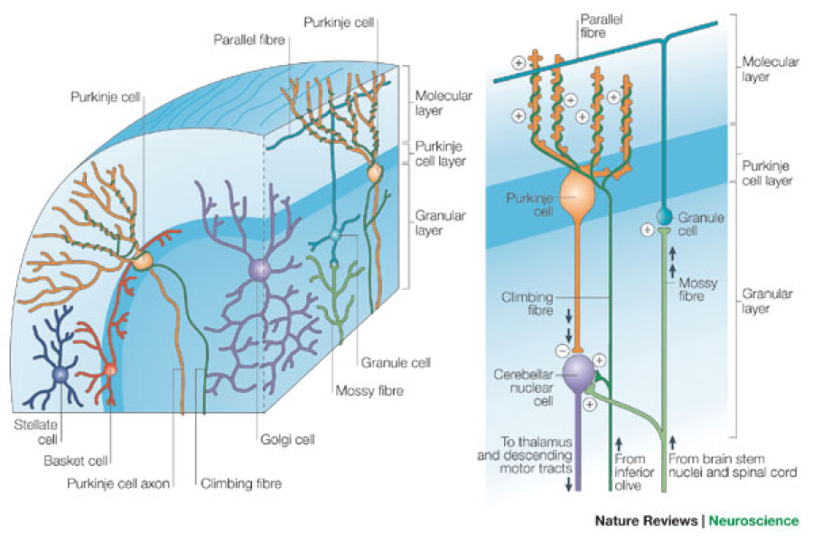
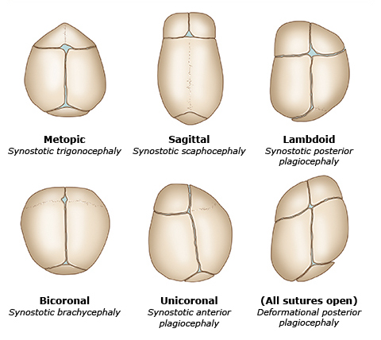
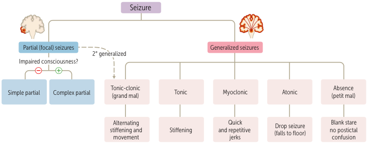

# Nervous System

## Neurotransmitters

|Neurotransmitter|Location|Precursor|Metabolites|
|-|-|-|-|
|Acetylcholine|Basal nucleus of Meynert|-|Acetate & Choline|
|Dopamine|Ventral tegmentum Substantia nigra|Tyrosine|Homovanillic acid (HVA)|
|Norepinephrine|Nucleus ceruleus|Tyrosine|Vanillylmandelic acid (VMA)|
|Epinephrine|Adrenal medulla|Tyrosine|Vanillylmandelic acid (VMA)|
|Serotonin|Raphe nucleus|Tryptophan|5-hydroxyindoleacetic acid (5-HIAA)|
|Histamine|-|Histidine|-|
|Glutamate|-|Glutamate|-|
|GABA|Nucleus accumbens|Glutamate|-|
|Glycine|-|Glycine|-|
|Opioid|-|-|-|

## Cerebral Cortex

### Layers

- Molecular layer
- External granular layer
- External pyramidal layer
- Internal granular layer
- Internal pyramidal layer
- Multiform layer

### Cells

- Horizontal [Cajal] cell
- Granular cell
- Pyramidal cella
- Fusiform cell
- Martinotti cell

## Cerebral Medulla

### Projections

- Corona radiata
- Internal capsule

### Associations

- Uncinate
- Superior longitudinal
- Inferior longitudinal
- Superior occipitofrontal
- Inferior occipitofrontal

### Commissures

- Fornix commissure
- Anterior commissure
- Corpus callosum

## Thalamus

|Nucleus|Function|
|-|-|
|Lateral geniculate nucleus (LGN)|Vision|
|Medial geniculate nucleus (MGN)|Audition|
|Ventral anterior (VA) Ventral lateral (VL)|Motion|
|Ventral posterolateral (VPL)|Sensation below the neck|
|Ventral posteromedial (VPM)|Sensation above the neck|

## Hypothalamus

|Nucleus|Function|
|-|-|
|Lateral|Hunger|
|Ventromedial|Satiety|
|Anterior|Parasympathetic|
|Posterior|Sympathetic|
|Suprachiasmatic|Circadian rhythm|
|Supraoptic|Vasopressin|
|Paraventricular|Oxytocin|

## Cerebellum

### Layers

|Structure|Input|Output|
|-|-|-|
|Molecular layer|-|-|
|Purkinje layer|Cerebellar cortex|Cerebellar nuclei|
|Granular layer|Mossy fiber|Purkinje cell|

### Fibers

|Structure|Input|Output|
|-|-|-|
|Mossy fiber|Cerebrum & Spinal cord|Granule cell|
|Climbing fiber|Inferior olivary nucleus|Purkinje cell|

### Cells

|Structure|Input|Output|
|-|-|-|
|Basket cell|-|Purkinje cell|
|Stellate cell|-|Purkinje cell|
|Granule cell|Mossy fiber|Purkinje cell|
|Purkinje cell|Cerebellar cortex|Cerebellar nuclei|

### Nuclei

|Structure|Input|Output|
|-|-|-|
|Dentate nucleus|-|-|
|Emboliform nucleus|-|-|
|Globose nucleus|-|-|
|Fastigial nucleus|-|-|

## Cerebellum

## Basal Ganglion

- Striatum: putamen & caudate nucleus
- Lentiform nucleus: putamen & globus pallidus

## Limbic System

- Fimbria
- Dentate gyrus
- Hippocampus
- Subiculum
- Cingulate gyrus
- Uncus
- Parahippocampus
- Amygdala

## Arterial Supply of the Brain

## Dural Venous Sinuses

## Ventricular System of the Brain

- Choroid plexus
- Lateral ventricles
- 3rd ventricle
- Cerebral aqueduct of Sylvius
- 4th ventricle
- Central canal
- Subarachnoid space
- Arachnoid granulations

## Arachnoid Granulation

## Groups of Cranial Nerves

|Group|Cranial Nerves|
|-|-|
|Pure sensory nerves|I & II & VIII|
|Pure motor nerves|III & IV & VI & XI & XII|
|Mixed sensory & motor nerves Branchial arch innervation|V & VII & IX & X|
|Parasympathetic nucleus|III & VII & IX & X|
|Solitary nucleus|VII & IX & X|
|Ambiguous nucleus|IX & X & XI|

## Afferent Pathways

|Pathway|Function|1° Neuron|2° Neuron|3° Neuron|
|-|-|-|-|-|
|CN I|SVA|Olfactory epithelium|Olfactory bulb|-|
|CN II|SSA|Retina|Thalamus :: LGN|-|
|CN V|GSA|Trigeminal ganglion|Trigeminal nucleus|Thalamus :: VPM|
|CN VII|SVA|Geniculate ganglion|Solitary nucleus|Thalamus|
|CN VIII|SSA|Vestibular ganglion|Vestibular nucleus|Thalamus :: MGN|
|||Spiral ganglion|Cochlear nucleus|Thalamus :: MGN|
|CN IX|GVA|Superior & Inferior ganglion|Solitary nucleus|Thalamus|
|CN X|GVA|Superior & Inferior ganglion|Solitary nucleus|Thalamus|

## Somatic Efferent Pathways

### Pyramidal

- Lateral corticospinal tract
- Ventral corticospinal tract

### Extrapyramidal

- Tectospinal tract
- Rubrospinal tract
- Vestibulospinal tract
- Reticulospinal tract

## Spinal Tracts

|Tract|Side|Functions|
|-|-|-|
|Dorsal column|Ipsilateral|Proprioception Touch Pressure Vibration|
|Spinothalamic tract|Contralateral|Pain Temperature|
|Lateral corticospinal tract|Ipsilateral|Motion|
|Ventral corticospinal tract|Contralateral|Motion|

## Pathway of Dorsal Column-Medial Lemniscus System

|Neuron|Level|Side|Structure|
|-|-|-|-|
|**1° Neuron**|Periphery|Ipsilateral|Peripheral nerve|
||Periphery|Ipsilateral|Dorsal root ganglion|
||Spinal cord|Ipsilateral|Dorsal column: Gracile fasciculus Cuneate fasciculus|
|**2° Neuron**|Medulla|Ipsilateral|Gracile nucleus Cuneate nucleus|
||Medulla|Decussation|Internal arcuate fiber|
||Medulla|Contralateral|Medial lemniscus|
|**3° Neuron**|Thalamus|Contralateral|VPL nucleus|
||Cerebrum|Contralateral|Internal capsule|
||Cerebrum|Contralateral|1°  somatic cortex|

## Pathway of Anterolateral System

|Neuron|Level|Side|Structure|
|-|-|-|-|
|**1° Neuron**|Periphery|Ipsilateral|Peripheral nerve|
||Periphery|Ipsilateral|Dorsal root ganglion|
|**2° Neuron**|Spinal cord|Ipsilateral|Substantia gelatinosa Nucleus proprius|
||Spinal cord|Decussation|Anterior white commissure|
||Spinal cord|Contralateral|Spinothalamic tract|
|**3° Neuron**|Thalamus|Contralateral|VPL nucleus|
||Cerebrum|Contralateral|Internal capsule|
||Cerebrum|Contralateral|1°  somatic cortex|

## Pathway of Corticospinal Tract

|Neuron|Level|Side|Structure|
|-|-|-|-|
|**1° Neuron**|Cerebrum|Ipsilateral|1° motor cortex|
||Cerebrum|Ipsilateral|Internal capsule|
||Midbrain|Ipsilateral|Cerebral peduncle|
||Medulla|Decussation|Pyramidal decussation|
||Spinal cord|Contralateral|Lateral corticospinal tract|
|**2° Neuron**|Spinal cord|Contralateral|Anterior horn|
||Periphery|Contralateral|Ventral root|

## Structures in the Spinal Cord

|Structure|Level|
|-|-|
|Cervical enlargement|C5 ~ T1|
|Lateral horn :: sympathetic|T1 ~ L2|
|Lumbosacral enlargement|L2 ~ S2|
|Lateral horn :: parasympathetic|S2 ~ S4|
|Cervical plexus|C5 ~ T1|
|Intercostal nerve|T1 ~ T11|
|Lumbosacral plexus|T12 ~ S4|
|Lumbar puncture|L3 ~ L5|

## Afferent Neurons

|Neuron|Fiber|Mnemonic|Sensation|
|-|-|-|-|
|I|-|Post|Proprioception|
|II|A-β|Traumatic|Touch Pressure Vibration|
|III|A-δ|Stress|Sharp pain Cold|
|IV|C|Disorder|Dull pain Warm|

## Cranial Nerve Reflexes

|Reflex|Afferent|Efferent|
|-|-|-|
|Pupillary|CN II|CN III|
|Corneal|CN V1|CN VII|
|Lacrimation|CN V1|CN VII|
|Jaw jerk|CN V3|CN V3|
|Vestibulo-ocular|CN VIII|CN III & IV & VI|
|Acoustic|CN VIII|CN VII|
|Gag|CN IX|CN X|

## Spinal Nerve Motor Functions and Reflexes

|Nerve|Motor Function|Reflex|
|-|-|-|
|C5|Elbow flexion|Biceps reflex Brachioradialis reflex|
|C6|Wrist extension|-|
|C7|Elbow extension|Triceps reflex|
|C8|Finger flexion|-|
|T1|Finger abduction|-|
|L2|Hip flexion|-|
|L3|Knee extension|-|
|L4|Ankle dorsiflexion|Patellar reflex|
|L5|Big toe extension|-|
|S1|Ankle plantar flexion Hip extension|Achilles reflex|

## Factors Affecting Cerebral Blood Flow

## Sleep-Wake Cycle

|Stage|Waves|Disorders|
|-|-|-|
|Awake :: eyes open|β wave|-|
|Awake :: eyes closed|α wave|-|
|NREM sleep N1|θ wave|-|
|NREM sleep N2|Sleep spindles K complexes|Bruxism|
|NREM sleep N3|δ wave|Sleep terrors Sleepwalking Bedwetting|
|REM sleep|β wave|Dreaming Nightmares Tumescence|

## Indications for Polysomnography

- Sleep apnea
- Sleep-wake disorders

## Craniosynostosis

|Type|Premature Suture|
|-|-|
|Trigonocephaly|Metopic|
|Scaphocephaly [Dolichocephaly]|Sagittal|
|Brachycephaly|Coronal|
|Plagiocephaly :: anterior|Unilateral coronal|
|Plagiocephaly :: posterior|Unilateral lambdoid|

## Neurologic Examination

### Muscle Power (MP)

|Grade|ROM|Anti-Gravity|Anti-Resistance|
|-|-|-|-|
|0|-|-|-|
|1|+/-|-|-|
|2|+|-|-|
|3|+|+|-|
|4|+|+|+|
|**5**|++|+|+|

### Deep Tendon Reflex (DTR)

|Grade|Response|
|-|-|
|0|None|
|1|Low|
|**2**|Normal|
|3|High|
|4|Clonus|

## Indications for CT Imaging for Head Trauma

### PECARN Rule

- GCS < 15
- Altered mental status
- Suspected skull fracture
- Non-frontal scalp hematoma
- LOC > 5 seconds
- Vomiting
- Headache
- Dangerous mechanism

### Canadian CT Head Rule

- GCS < 15 at 2 hours after injury
- Suspected skull fracture
- Vomiting ≥ 2 episodes
- Age > 65 years
- Retrograde amnesia
- Dangerous mechanism

## Signs of Basilar Skull Fracture

- Racoon eyes
- Battle sign
- CSF otorrhea
- CSF rhinorrhea
- Hemotympanum

## Cortical Signs

|Lobe|Area|Signs|
|-|-|-|
|Frontal|Prefrontal cortex|Personality changes|
||Frontal eye fields (FEF)|Ipsilateral conjugate deviation|
||Broca area :: dominant|Broca aphasia|
||Motor cortex|Contralateral paralysis|
|Parietal|Sensory cortex|Contralateral paresthesia|
||Arcuate fasciculus :: dominant|Conduction aphasia|
||Association cortex :: dominant|Gerstmann syndrome: Acalculia Agraphia Finger agnosia|
||Association cortex :: nondominant|Contralateral hemineglect Constructional apraxia Dressing apraxia|
||Superior optic radiation|Contralateral inferior quadrantanopia|
|Temporal|Wernicke area :: dominant|Wernicke aphasia|
||Meyer loop|Contralateral superior quadrantanopia|
|Occipital|Visual cortex|Contralateral hemianopia|

## Hemorrhage

### Extracranial

|Hemorrhage|Vessels|Bounded|
|-|-|-|
|Caput succedaneum|Soft tissues|-|
|Subgaleal|Subgaleal vessels|-|
|Cephalohematoma|Subperiosteal vessels|+|

### Intracranial

|Hemorrhage|Vessels|Bounded|
|-|-|-|
|Epidural|Middle meningeal artery|+|
|Subdural|Bridging veins|-|
|Subarachnoid|Aneurysm Arteriovenous malformation (AVM)|-|
|Intraparenchymal|Microaneurysm Lipohyalinosis Amyloid angiopathy|-|

## Risk of Progression of TIA to Ischemic Stroke {ABCD2}

- Age > 60 years
- BP > 140/90 mmHg
- Clinical features
  - Unilateral weakness
  - Speech impairment
- Duration
- Diabetes

## Presentation of Ischemic Stroke

|Artery|Lesions|Symptoms|
|-|-|-|
|Middle cerebral artery (MCA)|Motor cortex :: upper Sensory cortex :: upper Wernicke area Broca area Frontal eye fields (FEF)|Contralateral facial palsy Contralateral paralysis Contralateral paresthesia Aphasia Hemineglect|
|Anterior cerebral artery (ACA)|Motor cortex :: lower Sensory cortex :: lower|Contralateral paralysis Contralateral paresthesia|
|Posterior cerebral artery (PCA)|Occipital lobe|Contralateral hemianopia|
|Lenticulo-striate artery|Internal capsule Striatum|Contralateral paralysis|
|Basilar artery|CN VI Paramedian pontine reticular formation (PPRF) Corticobulbar tract Corticospinal tract|Locked-in syndrome Medial pontine syndrome: Horizontal gaze palsy Pseudobulbar palsy Contralateral paralysis|
|Anterior inferior cerebellar artery (AICA)|CN VII & CN VIII Sympathetic fibers Cerebellar peduncles|Lateral pontine syndrome: Ipsilateral facial palsy Ipsilateral deafness Ipsilateral vertigo Ipsilateral Horner syndrome Ipsilateral ataxia|
|Posterior inferior cerebellar artery (PICA)|Ambiguous nucleus Sympathetic fibers Cerebellar peduncle Lateral spinothalamic tract|Lateral medullary [Wallenberg] syndrome: Dysphagia Dysarthria ↓ Gag reflex Contralateral palate deviation Ipsilateral Horner syndrome Ipsilateral ataxia Contralateral paresthesia|
|Anterior spinal artery (ASA)|CN XII Corticospinal tract Medial lemniscus|Medial medullary syndrome: Ipsilateral tongue deviation Contralateral paralysis Contralateral paresthesia|

## Workup of Ischemic Stroke

- Coagulation panel
- Non-contrast CT of the head
- CT angiography of the head and neck
- MR imaging of the head
- Carotid ultrasound
- Electrocardiography (ECG)
- Echocardiography

## Treatment of Ischemic Stroke

- Antihypertensives
  - BP < 185/110 mmHg if revascularization
  - BP < 220/120 mmHg otherwise
- Antihyperglycemic if glucose > 140 ~ 180 mg/dL
- Antiplatelets
- Revascularization
  - Thrombolysis if duration < 3 ~ 4.5 hours
  - Thrombectomy if duration < 6 ~ 24 hours

## Ideal Door-to-Reperfusion Time for Ischemic Stroke

- Door-to-needle < 60 minutes
- Door-to-puncture < 120 minutes

## Brain Lesions & Breathing Patterns

|Brain Lesion|Breathing Pattern|
|-|-|
|Cerebrum|Cheyne-Stokes respiration|
|Midbrain|Tachypnea|
|Upper pons|Apneustic respiration|
|Lower pons|Cluster respiration|
|Medulla|Ataxic [Biot] respiration|

## Neurologic Examination for Hemineglect

- Cancellation test
- Reading test
- Bisection of lines
- Copy of drawings

## Aphasia

|Aphasia|Comprehension|Repetition|Fluency|
|-|-|-|-|
|Global|↓|↓|↓|
|Broca|-|↓|↓|
|Wernicke|↓|↓|-|
|Conduction|-|↓|-|
|Mixed transcortical|↓|-|↓|
|Transcortical motor|-|-|↓|
|Transcortical sensory|↓|-|-|

## Triad of Normal Pressure Hydrocephalus (NPH) {3W}

|Mnemonic|Presentation|
|-|-|
|Wet|Urinary incontinence|
|Wobbly|Ataxia|
|Wacky|Cognitive dysfunction|

## Presentation of Elevated Intracranial Pressure (ICP)

- Cushing triad
  - Pressure :: hypertension & ↑ pulse pressure
  - Pulse :: bradycardia
  - Respiration :: pattern change
- ↓ Consciousness
- Headache
- Nausea ± vomiting
- Papilledema
- Diplopia

## Treatment of Elevated Intracranial Pressure (ICP)

- Position :: head elevation
- Hyperventilation
- Diuretics :: Mannitol
- Sedation
- Corticosteroids
- Craniectomy

## Treatment of Idiopathic Intracranial Hypertension (IIH)

- Weight loss
- Diuretics
  - Acetazolemide
  - Loop diuretics
- Topiramate
- Lumbar puncture
- Shunting
- Optic nerve sheath fenestration

## Contraindications to Lumbar Puncture

- Skin infection over puncture site
- Brain mass causing ↑ intracranial pressure (ICP)

## Types of Primary Headaches

||Cluster|Migraine|Tension|
|-|-|-|-|
|Sex|Male|Female|-|
|Laterality|Unilateral|Unilateral|Bilateral|
|Location|Periorbital|Head|Band|
|Duration|15 minutes ~ 3 hours|4 hours ~ 3 days|30 minutes ~ 7 days|
|Triggers|-|+|+|

## Treatment of Primary Headaches

|Headache|Acute|Chronic|
|-|-|-|
|Cluster|100% O2 -Triptans|Verapamil|
|Migraine|NSAIDs -Triptans Ergotamine|β antagonists TCAs Valproate Topiramate Botulinum toxin Lifestyle modification|
|Tension|NSAIDs Acetaminophen|TCAs Lifestyle modification|

## Red Flags for Secondary Headaches

- Sudden onset
- Onset after 50 y/o
- ↑ frequency or severity
- New onset with an underlying medical condition
- Focal neurologic sequelae
- Papilledema
- Preceding head trauma

## Seizures

## Anticonvulsants

|Mechanism|Medication|
|-|-|
|Na channel blockers|Phenytoin Valproate Carbamazepine Lamotrigine Topiramate|
|Ca channel blockers|Ethosuximide Gabapentin Pregabalin|
|SV2A antagonists|Levetiracetam|
|GABAA agonists|Barbiturates Benzodiazepines|
|GABA reuptake inhibitors|Tiagabine|
|GABA transaminase inhibitors|Vigabatrin|

## Treatment of Status Epilepticus

- Barbiturates
- Benzodiazepines
- Phenytoin

## Treatment of Neuropathic Pain

- Ca channel blockers
  - Gabapentin
  - Pregabalin
- Reuptake inhibitors
  - TCAs
  - SNRIs

## Treatment of Essential Tremor

- β antagonists :: Propranolol
- Barbiturates :: Primidone

## Neurodegenerative Disorders

|Disorder|Lesions|Findings|Precursor|
|-|-|-|-|
|Parkinson disease|Substantia nigra|Lewy body|α-Synuclein|
|Huntington disease|Striatum|-|-|
|Alzheimer disease|Cortex Hippocampus|Senile plaque|Amyloid precursor protein (APP)|
|||Neurofibrillary tangle|Tau protein|
|||Hirano body|Actin|
|Frontotemporal dementia|Frontotemporal lobe|Pick body|Tau protein|
|Lewy body dementia|Cortex|Lewy body|α-Synuclein|
|Vascular dementia|Cortex|-|-|
|Normal pressure hydrocephalus (NPH)|-|-|-|
|Creutzfeldt-Jakob disease|Striatum|Prion|Prion protein (PrP)|

## Basal Ganglia and Diseases

## Presentation of Parkinson Disease {PARTS}

- Postural instability
- Akinesia & Bradykinesia
- Rigidity :: cogwheel
- Tremor :: resting & pill-rolling
- Shuffling gait

## Medications for Parkinson Disease

|Mechanism|Medication|
|-|-|
|M antagonists|Benztropine|
|D2 agonists|Bromocriptine Cabergoline Pramipexole Ropinirole|
|MAO inhibitors|Selegiline|
|COMT inhibitors|-Capones|
|Dopa|Levodopa|
|Dopa decarboxylase inhibitors|Carbidopa Benserazide|
|NMDA antagonists|Amantadine|

## Treatment of Restless Legs Syndrome (RLS)

- Ca channel blockers
  - Gabapentin
  - Pregabalin
- Levodopa
- D2 agonists
  - Pramipexole
  - Ropinirole

## Medications for Huntington Disease

|Mechanism|Medication|
|-|-|
|VMAT2 inhibitors|Tetrabenazine Valbenazine|
|D2 antagonists|2° Antipsychotics|

## Medications for Alzheimer Disease

|Mechanism|Medication|
|-|-|
|ACh esterase inhibitors|Rivastigmine Galantamine Donepezil|
|NMDA antagonists|Memantine|

## Etiology of Myelopathy

|Lesion|Dorsal Column|Spinothalamic Tract|Corticospinal Tract|Anterior Horn|
|-|-|-|-|-|
|Syringomyelia|-|-|-|-|
|Poliomyelitis|-|-|-|+|
|Spinal muscular atrophy (SMA)|-|-|-|+|
|Amyotrophic lateral sclerosis (ALS)|-|-|+|+|
|Tabes dorsalis|+|-|-|-|
|Subacute combined degeneration (SCD)|+|-|+|-|
|Anterior spinal artery syndrome|-|+|+|+|
|Brown-Sequard syndrome|+|+|+|+|
|Transverse myelopathy|+|+|+|+|

## Etiology of Peripheral Neuropathy

- Heme synthesis disorders
- Diabetic neuropathy
- Chemotherapy toxicity
- Tabes dorsalis
- Subacute combined degeneration (SCD)
- Guillain-Barre syndrome (GBS)
- Charcot-Marie-Tooth (CMT) disease

## Demyelinating Diseases

- Central pontine myelinolysis (CPM)
- Multiple sclerosis
- Progressive multifocal leukoencephalopathy (PML)
- Leukodystrophies
- Tabes dorsalis
- Subacute combined degeneration (SCD)
- Guillain-Barre syndrome (GBS)
- Charcot-Marie-Tooth (CMT) disease

## Charcot Triad of Multiple Sclerosis {SIN}

- Scanning speech
- Intention tremor
- Incontinence
- Internuclear ophthalmoplegia
- Nystagmus

## White Matters Affected By Multiple Sclerosis

|White Matter|Symptoms|
|-|-|
|Optic nerve|Marcus Gunn pupil|
|Medial longitudinal fasciculus (MLF)|Internuclear ophthalmoplegia Nystagmus|
|Cerebellum|Scanning speech Intention tremor|
|Spinal cord|Incontinence|

## Types of Multiple Sclerosis

- Relapsing-remitting
- Progressive relapsing
- 1° progressive
- 2° progressive

## Treatment of Multiple Sclerosis

|Mechanism|Medication|
|-|-|
|NF-κB inhibitors|Corticosteroids|
|CD20 inhibitors|Ocrelizumab|
|CD52 inhibitors|Alemtuzumab|
|α4-integrin inhibitors|Natalizumab|
|-|Plasmapheresis|
|-|IFN-β|

## Treatment of Guillain-Barre Syndrome (GBS)

- Plasmapheresis
- Intravenous immunoglobulin (IVIG)

## Comparison Between UMN and LMN Lesions

||UMN|LMN|
|-|-|-|
|Weakness|+|+|
|Atrophy|-|+|
|Fasciculations|-|+|
|Tone|↑|↓|
|Reflexes|↑|↓|
|Primitive reflexes|+|-|
|Paralysis|Spastic|Flaccid|

- Upper motor neuron (UMN)
- Lower motor neuron (LMN)

## Physical Examination for Nerve Injuries

|Exam|Injury|
|-|-|
|Lhermitte sign|Cervical myelopathy|
|Spurling test|Cervical radiculopathy|
|Kemp test|Lumbar radiculopathy|
|Straight leg raising test (SLRT)|Lumbar radiculopathy|
|Hoffmann sign|UMN lesion|
|Babinski sign|UMN lesion|

## Evoked Electromyography (EMG)

.png)

## Interpretation of Electromyograghy (EMG)

|Condition|Rest|Amplitude|Duration|Phase|Recruitment|
|-|-|-|-|-|-|
|Normal|-|0.2 ~ 2 mV|5 ~ 15 ms|Triphasic|-|
|Neuropathy :: UMN|-|-|-|Triphasic|-|
|Neuropathy :: LMN|Fibrillations|↑|↑|Polyphasic|↓|
|Myopathy :: non-inflammatory|-|↓|↓|Polyphasic|↑|
|Myopathy :: inflammatory|Fibrillations|↓|↓|Polyphasic|↑|

## Etiology of Myopathy

- Inflammatory myopathy
  - Polymyositis
  - Dermatomyositis
- Endocrine
  - Hypothyroidism
  - Cushing syndrome
- Metabolic myopathy
  - Glycogen storage diseases (GSD)
  - Lysosomal storage diseases (LSD)
- Muscular dystrophy
  - Duchenne muscular dystrophy (DMD)
  - Myotonic dystrophy
  - Limb-girdle muscular dystrophy
- Drug-induced myopathy
- Rhabdomyolysis

## Comparison Between Myopathy and Myalgia

||Myopathy|PMR|Fibromyalgia|
|-|-|-|-|
|ESR|↑/-|↑|-|
|CK|↑|-|-|

## Pathogenesis of Horner Syndrome

## Etiology of Horner Syndrome

- Ischemic stroke
  - Anterior inferior cerebellar artery (AICA)
  - Posterior inferior cerebellar artery (PICA)
- Pancoast tumor
- Carotid dissection

## Presentation of Horner Syndrome {MAP}

- Miosis
- Anhidrosis
- Ptosis :: superior tarsal muscle

## Etiology of Neurogenic Bladder

- Stroke
- Normal pressure hydrocephalus (NPH)
- Multiple sclerosis
- Neurodegenerative disorders
- Cauda equina syndrome
- Herniated disk
- Spinal cord injury
- Spinal stenosis
- Diabetic neuropathy

## CSF Analysis

||Pressure|WBCs|Glucose|Protein|
|-|-|-|-|-|
|Normal|50 ~ 180 mmH2O|< 5/mm3|40 ~ 70 mg/dL|20 ~ 45 mg/dL|
|Inflammatory|-|-|-|↑|
|Bacterial|↑|↑ PMNs|↓|↑|
|TB & Fungal|↑|↑ Lymphocytes|↓|↑|
|Viral|↑|↑ Lymphocytes|-|↑|

## Routes of Brain Abscess Transmission

- Hematogenous spread
- Direct spread
  - Paranasal sinusitis
  - Otitis media
  - Mastoiditis
  - Dental infection
- Direct innoculation

## Pathogens of Encephalitis

- Arbovirus
- Enterovirus
- HSV
- VZV
- CMV
- Toxoplasmosis
- Malaria

## Pathogens of Meningitis

- Streptococcus pneumonia
- Haemophilus influenzae
- Neisseria meningitidis
- Enterovirus
- HSV & HIV
- Cryptococcus

## Empirical Antibiotics for Meningitis

|Patient|Antibiotics|
|-|-|
|≤ 1 month|Ampicillin & (3° Cephalosporins / Aminoglycosides)|
|1 ~ 3 months|Vancomycin & 3° Cephalosporins|
|3 months ~ 60 years|Vancomycin & 3° Cephalosporins|
|≥ 60 years Complicated|Vancomycin & Ampicillin & 3° Cephalosporins|

## Nervous System Tumors

### Central Nervous System (CNS) Tumors

|Cell|Origin|Tumors|
|-|-|-|
|Neurons|Neural tube|Neuroblastoma|
|Astrocytes|Neural tube|Astrocytoma|
|Ependymal cells|Neural tube|Ependymoma|
|Oligodendrocytes|Neural tube|Oligodendroglioma|
|Neuroendocrine cells|Neural tube|Pinealoma|
|Neuroendocrine cells|Surface ectoderm|Craniopharyngioma Pituitary adenoma|
|Meninges|Neural crest|Meningioma|
|Microglia|Mesoderm|-|

### Peripheral Nervous System (PNS) Tumors

|Cell|Origin|Tumors|
|-|-|-|
|Neurons|Neural crest|Neuroblastoma|
|Schwann cells|Neural crest|Schwannoma|
|Neuroendocrine cells|Neural crest|Pheochromocytoma Paraganglioma|

## WHO Grading of Astrocytoma

|Grade|Tumor|
|-|-|
|1|Pilocytic astrocytoma|
|2|Fibrillary astrocytoma|
|3|Anaplastic astrocytoma|
|4|Glioblastoma multiforme|

## Neural Crest Tumors

- Neuroblastoma
- Pheochromocytoma
- Paraganglioma
- Schwannoma
- Neurofibroma
- Melanoma

## Management of Pituitary Adenoma

|Condition|Management|
|-|-|
|Prolactinoma|Pharmacotherapy|
|Non-PRL secretory|Surgery|
|Non-secretory|Surgery|
|Asymptomatic|Observation|

## Disorders of Consciousness

||Awareness|SWC|BR|SR|
|-|-|-|-|-|
|Brain death|-|-|-|-|
|Coma|-|-|+|+|
|Vegetative state|-|+|+|+|
|Minimally conscious state|±|+|+|+|
|Locked-in syndrome|+|+|+|+|

- Sleep-wake cycle (SWC)
- Brainstem reflex (BR)
- Spontaneous respiration (SR)

## Neurologic Examination for Brain Death

- Posturing
- Pupillary reflex
- Corneal reflex
- Vestibulo-ocular reflex
- Gag reflex
- Cough reflex
